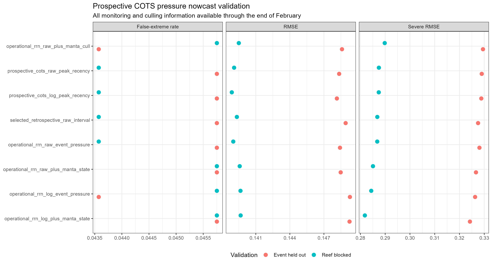
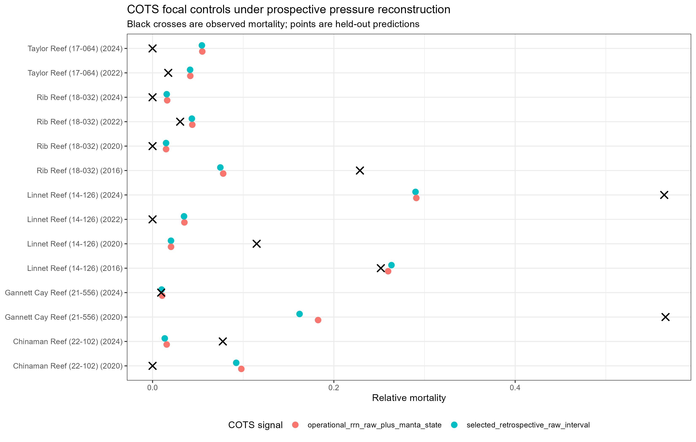
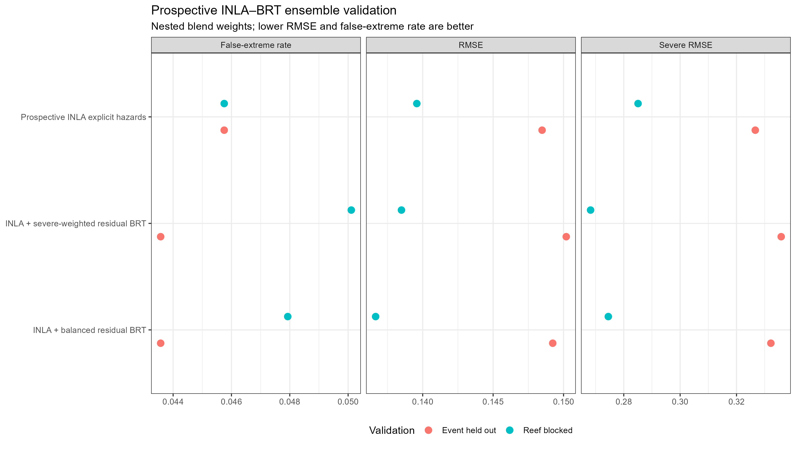
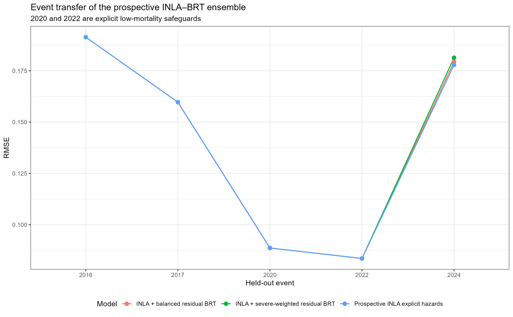
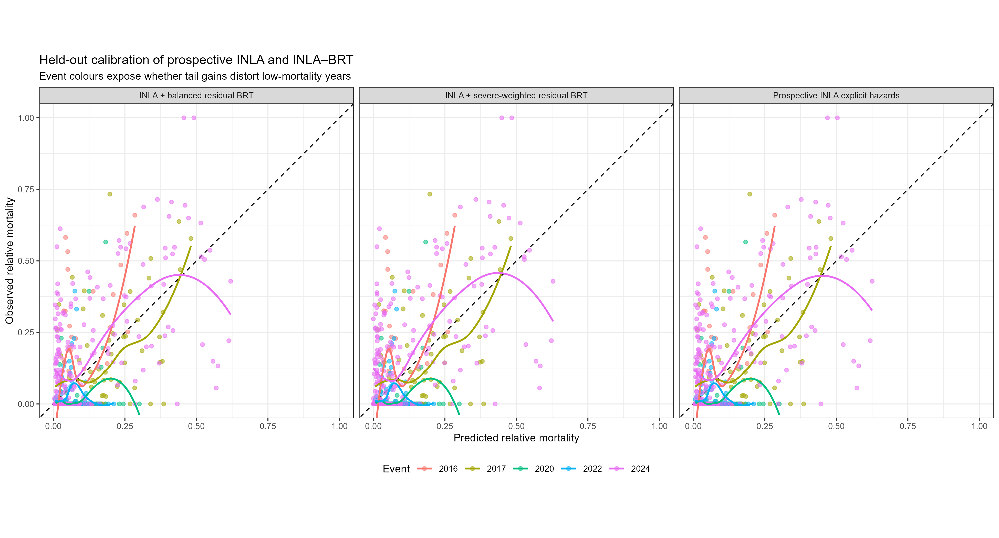
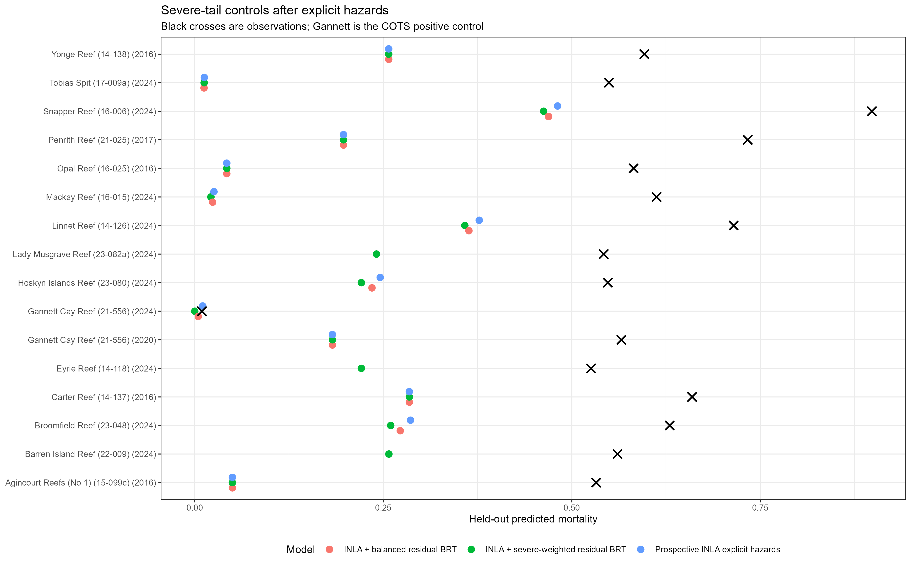
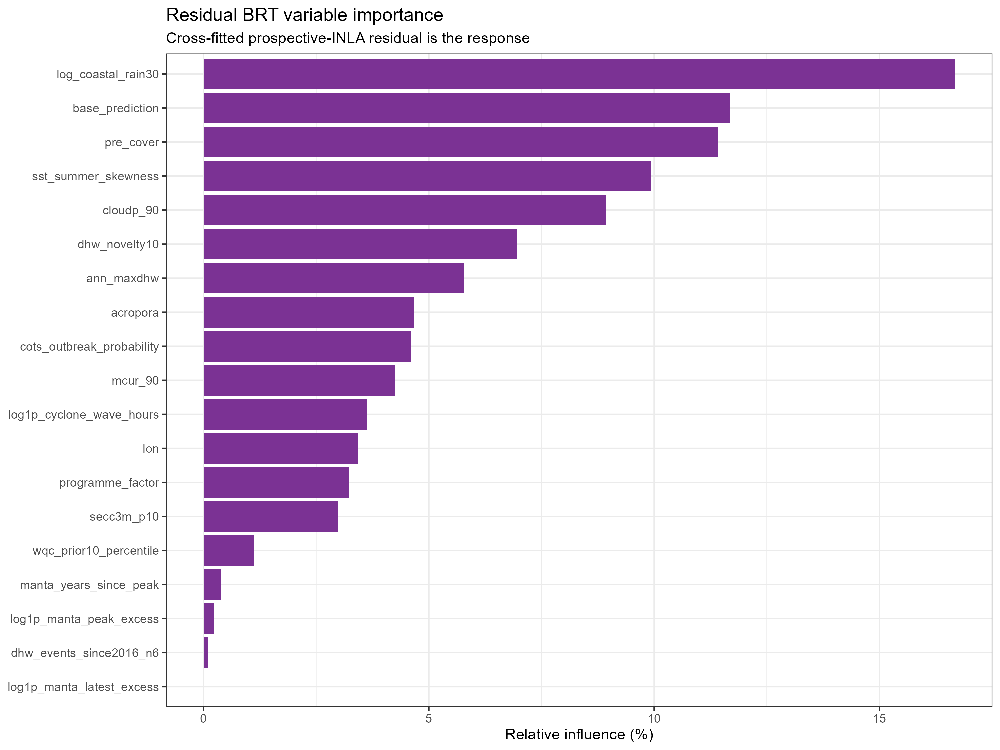
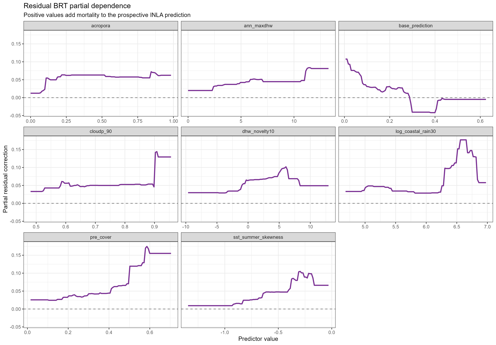

```{r}
#| label: setup
suppressPackageStartupMessages({
  library(dplyr)
  library(readr)
  library(knitr)
})
source('../../src/lib/model_registry.R')
source('../../src/lib/model_diagnostics.R')

root <- project_root()
registry <- read_model_registry(root)
selected <- selected_model_snapshot(root)
best <- selected$best_model
write_model_snapshot(root)
diagnostics <- run_standard_inla_diagnostics(best$id, root)
write_figure_readme(root)

raw_cots_dir <- file.path(root, 'output', 'cots_raw_enso_occurrence')
raw_cots_comparison <- read_csv(
  file.path(raw_cots_dir, 'cots_model_comparison.csv'), show_col_types = FALSE
)
occurrence_state_comparison <- read_csv(
  file.path(raw_cots_dir, 'occurrence_model_comparison.csv'), show_col_types = FALSE
)
nowcast_comparison <- read_csv(
  file.path(raw_cots_dir, 'nowcast_model_comparison.csv'), show_col_types = FALSE
)
early_update_dir <- file.path(root, 'output', 'spatial_early_bleaching_update')
early_update_comparison <- read_csv(
  file.path(early_update_dir, 'model_comparison.csv'), show_col_types = FALSE
)
early_update_sources <- read_csv(
  file.path(early_update_dir, 'early_source_summary.csv'), show_col_types = FALSE
)
prospective_cots_dir <- file.path(root, 'output', 'prospective_cots_nowcast')
prospective_cots_comparison <- read_csv(
  file.path(prospective_cots_dir, 'model_comparison.csv'), show_col_types = FALSE
)
ensemble_dir <- file.path(root, 'output', 'inla_brt_residual_ensemble')
ensemble_comparison <- read_csv(
  file.path(ensemble_dir, 'model_comparison.csv'), show_col_types = FALSE
)
ensemble_weights <- read_csv(
  file.path(ensemble_dir, 'blend_weights.csv'), show_col_types = FALSE
)
full_brt_dir <- file.path(root, 'output', 'standalone_brt_envelope_ensemble')
full_brt_comparison <- read_csv(
  file.path(full_brt_dir, 'model_comparison.csv'), show_col_types = FALSE
)
full_brt_event_metrics <- read_csv(
  file.path(full_brt_dir, 'event_metrics.csv'), show_col_types = FALSE
)
full_brt_envelope_metrics <- read_csv(
  file.path(full_brt_dir, 'envelope_metrics.csv'), show_col_types = FALSE
)
full_brt_promotion <- read_csv(
  file.path(full_brt_dir, 'promotion_assessment.csv'), show_col_types = FALSE
)

fig_dir <- file.path(root, 'output', 'fig')
include_figure <- function(id, note = NULL) {
  match <- list.files(fig_dir, pattern = paste0('^', id, '.*\\.png$'), full.names = TRUE)
  if (length(match) == 0L) {
    cat('*Figure has not yet been generated.*\n')
  } else {
    figure_path <- file.path('..', 'output', 'fig', basename(match[[1]]))
    cat(paste0('\n'))
  }
  if (!is.null(note)) cat(note, '\n')
}
```

## Purpose and scope

This is the persistent, research-facing ledger for the GBR coral bleaching mortality pipeline. The registry, rather than this document, declares the selected operational model. The report must be re-rendered after every direct model comparison; it is not a manually maintained summary.

The selected model is `r best$id` (`r best$framework`), with local-first thermal calibration and leave-one-event-out validation as the primary selection design. The full-data event model below is explanatory only and must not be interpreted as prospective forecast performance.

### Model at a glance

The model answers two linked questions for each reef-event observation:

1. **Did measurable mortality occur?** A Bernoulli component estimates the probability that mortality is greater than zero.
2. **If mortality occurred, how large was it?** A beta component estimates the relative mortality proportion among positive observations.

The thermal/freshwater expected mortality is the probability of mortality multiplied by its expected positive magnitude. LTMP, manta tow and MMP retain programme-specific observation layers. Independent COTS and cyclone occurrence/magnitude hazards are trained from the longer cause-labelled annual transition record and combined with the thermal component on the mortality scale. This prevents known non-thermal losses from flattening the thermal dose-response while retaining them in operational prediction.

```{r}
#| results: asis
render_model_contract(root)
```

## How to read the model formula

The long equation is easier to understand as five connected blocks:

- **Thermal dose-response.** Local-first DHW is represented by a linear spline with hinges at 4 and 8 DHW. Below 4 DHW the slope is the main DHW coefficient. Between 4 and 8 DHW the slope is the main coefficient plus the first hinge coefficient. Above 8 DHW it is the sum of all three thermal coefficients. Formally, the hinge variables are $H_4=\max(DHW-4,0)$ and $H_8=\max(DHW-8,0)$.
- **Ecological susceptibility and exposure history.** Pre-event Acropora, starting coral cover, ten-year heat load, thermal novelty, number of prior events and years since the previous event modify baseline susceptibility.
- **Environmental modifiers.** Water clarity, cloud, current speed, rainfall, coloured-water exposure, SST distribution and chlorophyll modify the thermal/freshwater response. COTS and cyclone exposures enter separate cause hazards.
- **Interactions.** Terms such as $H_4\times Acropora$ or $H_4\times coloured\ water$ allow the DHW response to steepen or flatten under different reef conditions. They are modifiers of the thermal response, not separate mortality estimates.
- **Unmeasured structure.** Reef-event, bleaching-event and persistent spatial effects absorb repeat-observation dependence and residual geographic structure not explained by measured covariates. These terms improve calibration but should not be given a causal interpretation.

The coefficients are estimated on the logit scale. A positive coefficient raises the probability or magnitude of mortality after accounting for the other terms; a negative coefficient lowers it. Because most predictors are standardised, coefficient magnitudes describe a one-standard-deviation contrast rather than one unit in the predictor's original units.

### What the 10th and 90th percentiles mean

These percentiles summarise the tails of an environmental distribution within the relevant reef/event extraction period. They are not probabilities of mortality.

| Model variable | Interpretation before standardisation | Direction to remember |
|---|---|---|
| Low Secchi depth (`secc3m_p10`) | The 10th percentile is the value below which 10% of Secchi observations fall. A low value means the poorer-visibility tail contains very low water clarity; a high value means even the low-clarity tail remains relatively clear. | Lower values = more extreme turbidity/low clarity. |
| High cloud cover (`cloudp_90`) | The 90th percentile is the value below which 90% of cloud observations fall. It characterises the cloudy upper tail rather than mean cloudiness. | Higher values = stronger high-cloud episodes. |
| High current speed (`mcur_90`) | The 90th percentile characterises the fast-current upper tail. It does not mean currents are this fast for 90% of the period. | Higher values = stronger high-current episodes. |

“Fold-standardised” means the training-fold mean is subtracted and the result divided by the training-fold standard deviation. A value of zero is average for that training fold; +1 is one standard deviation above it and -1 is one standard deviation below it. The assessment fold is transformed using the training values, avoiding information leakage.

## Directly compared operational candidates

```{r}
ledger <- model_metrics(root) |>
  filter(is.na(scheme) | scheme == 'leave_one_event_out') |>
  mutate(across(c(rmse, mae, predictive_r2, severe_rmse, false_extreme_rate), ~ round(.x, 3)))
kable(ledger, caption = 'Registry candidates and leave-one-event-out validation metrics. WAIC/DIC are in-sample criteria and are supplementary to held-out performance.')
```

The primary held-out metrics for the selected model are RMSE `r sprintf('%.3f', best$selection_metrics$leave_one_event_out_rmse)`, predictive R² `r sprintf('%.3f', best$selection_metrics$leave_one_event_out_predictive_r2)`, severe-event RMSE `r sprintf('%.3f', best$selection_metrics$leave_one_event_out_severe_rmse)`, and false-extreme rate `r sprintf('%.3f', best$selection_metrics$leave_one_event_out_false_extreme_rate)`.

## DHW hinge sensitivity

The selected model originally used hinges at 4 and 8 DHW. A controlled candidate moved the first hinge and every associated modifier interaction from 4 to 6 DHW while holding the data, priors, covariates, latent structure and validation folds constant.

```{r}
hinge_comparison_path <- file.path(root, 'output', 'inla_hinge_sensitivity', 'hinge_comparison.csv')
hinge_comparison <- read_csv(hinge_comparison_path, show_col_types = FALSE) |>
  select(first_hinge_dhw, scheme, rmse, predictive_r2, severe_rmse,
         false_extreme_rate, waic, dic) |>
  mutate(across(where(is.numeric), ~ round(.x, 3)))
kable(hinge_comparison, caption = 'Controlled comparison of 4+8 versus 6+8 DHW spline hinges.')
```

The **4+8 DHW hinge remains selected**. In leave-one-event-out validation it reduced RMSE from 0.169 to 0.158, increased predictive R-squared from 0.097 to 0.211, and reduced severe-event RMSE from 0.374 to 0.345. It also had lower WAIC and DIC. The 6+8 candidate produced a very small reef-blocked RMSE improvement, but its severe-event RMSE and false-extreme rate were worse in that validation. The evidence therefore supports retaining the biologically familiar 4-DHW onset while keeping the second change in slope at 8 DHW.

```{r}
#| results: asis
include_figure('Fig-INLA-05_hinge_validation')
```

```{r}
#| results: asis
include_figure('Fig-INLA-06_hinge_response')
```

## Predictor correlation and model complexity

The model contains many ecological mechanisms, but several are mathematically or environmentally related. The matrix below includes every numeric fixed-effect predictor, including spline bases and interactions. Correlations above 0.65 are printed in the cells.

```{r}
#| results: asis
include_figure('Fig-DATA-01_predictor_correlation')
```

```{r}
top_pairs <- diagnostics$predictor_correlation$pairs |>
  mutate(correlation = round(correlation, 3)) |>
  select(`Predictor 1` = label_x, `Predictor 2` = label_y, correlation) |>
  head(12)
kable(top_pairs, caption = 'Twelve strongest non-duplicate predictor correlations in the selected model.')
```

The strongest redundancies are expected in the three DHW spline bases, among heat-history summaries, and between current and cumulative coloured-water exposure and their interactions. This does make individual coefficients less stable and argues for mechanism-level ablation tests. It does **not** automatically mean the predictive model should drop those terms: hinge bases and their interactions are intentionally correlated, and removal should be decided using held-out event and reef performance rather than a correlation threshold alone.

### Collinearity and complementarity gate

Every new candidate must now pass this sequence before fitting:

1. Calculate pairwise correlations and missingness for the proposed training-fold predictors.
2. Mark spline bases and hierarchy-respecting interactions as **structural**; assess them jointly and do not prune individual basis columns.
3. For non-structural pairs with $|r|\geq0.8$, nominate the term with the clearer mechanism, more direct measurement and better operational availability.
4. Remove a main effect together with interactions derived from it, preserving model hierarchy.
5. Compare the reduced mechanism set using leave-one-event-out and reef-blocked validation, including severe-event RMSE and false-extreme rate. Only promote a reduction if prediction is retained within uncertainty or improved.

The current audit identified an important feature-engineering problem: `wqc_10yr_sum` includes the current year's WQC, producing $r=0.950$ with current WQC and $r=0.973$ between their DHW interactions. The extraction pipeline now creates a separate **prior-only** ten-year WQC sum. The inclusive cumulative term is excluded from new candidate sets and will only return if it demonstrates complementary held-out value under a clearly separated historical definition.

```{r}
collinearity_comparison <- read_csv(
  file.path(root, 'output', 'inla_collinearity_sensitivity', 'model_comparison.csv'),
  show_col_types = FALSE
) |>
  select(candidate, scheme, rmse, predictive_r2, severe_rmse,
         false_extreme_rate, waic, dic) |>
  mutate(across(where(is.numeric), ~ round(.x, 3)))
kable(collinearity_comparison, caption = 'Controlled test of the initial collinearity-reduced candidate.')
```

```{r}
#| results: asis
include_figure('Fig-INLA-08_collinearity_reduction')
```

Removing ten-year DHW load and the inclusive cumulative-WQC pair together did not improve the primary validation: event-held-out RMSE changed from 0.158 to 0.159 and predictive R-squared from 0.211 to 0.196, although severe-event RMSE improved slightly. This combined reduction is therefore not promoted as the selected model. The next comparison should isolate the heat-history and corrected prior-only WQC decisions separately; the current selected model remains the predictive reference until that controlled replacement is complete.

## COTS outbreak probability and observed intensity

The two available COTS variables describe different quantities. The hindcast is the probability that COTS density exceeds **0.22 COTS per tow**. The RRN interval maximum is a continuous estimate of realised COTS density. The previous additive model entered their standardised values directly. A controlled candidate replaced the raw log-intensity term with a probability-weighted excess:

$$
C_i = p_i\,\log\left[1 + \max\left(I_i - 0.22,\,0\right)\right],
$$

where $p_i$ is the hindcast outbreak probability and $I_i$ is the RRN interval maximum in COTS per tow. The probability main effect remains in the model. This distinguishes likely outbreaks from their observed intensity while avoiding three strongly overlapping COTS terms.

```{r}
cots_comparison <- read_csv(
  file.path(root, 'output', 'inla_cots_hazard_sensitivity', 'model_comparison.csv'),
  show_col_types = FALSE
) |>
  select(candidate, scheme, rmse, predictive_r2, severe_rmse,
         false_extreme_rate, occurrence_brier, waic, dic) |>
  mutate(across(where(is.numeric), ~ round(.x, 3)))
kable(cots_comparison, caption = 'Controlled comparison of additive COTS probability/intensity and probability plus probability-weighted intensity above 0.22 COTS/tow.')
```

```{r}
#| results: asis
include_figure('Fig-INLA-10_cots_probability_severity')
```

This single-coefficient representation improved aggregate validation modestly but is now superseded by the cause-aware competing-hazard model below. It remains useful evidence that probability and realised intensity are complementary; it is not the current operational representation.

### Gannett Cay diagnostic

```{r}
gannett_audit <- read_csv(
  file.path(root, 'output', 'inla_cots_hazard_sensitivity', 'gannett_cay_audit.csv'),
  show_col_types = FALSE
) |>
  filter(event_year == 2020) |>
  transmute(
    model = recode(
      candidate,
      selected_additive_cots = 'Current additive COTS',
      cots_probability_severity = 'Probability + weighted intensity'
    ),
    observed_mortality = round(observed_mortality, 3),
    heldout_prediction = round(predicted_mortality, 3),
    heldout_residual = round(residual, 3),
    rrn_cots_per_tow = round(cot_interval_idw_max, 2),
    hindcast_probability = round(cots_outbreak_probability, 3)
  )
kable(gannett_audit, caption = 'Leave-2020-out Gannett Cay diagnostic.')
```

Gannett Cay has **9.91 COTS per tow**, about 45 times the 0.22 outbreak threshold, together with high hindcast outbreak probability. It is therefore strong multi-source evidence of a COTS-associated loss. The simple additive candidate still failed here, which motivated the separate cause component evaluated next.

## Cause-aware COTS and cyclone competing hazards

The cause-aware architecture refits the thermal/freshwater component after excluding explicitly labelled COTS, cyclone and flood rows from its thermal training data. Two independent Bernoulli-beta cause hazards are trained from cause-labelled annual coral-cover transitions. Their expected losses combine as

$$\widehat M_i=1-(1-T_i)(1-C_i)(1-S_i),$$

where the COTS hazard is activated only when RRN density exceeds **0.22 COTS/tow**. The first cause-aware candidate used a hard cyclone gate above 20 damaging-wave hours. That controlled test established the value of cause separation; the current selected activation is refined below.

```{r}
cause_comparison <- read_csv(
  file.path(root, 'output', 'cause_aware_competing_hazards', 'model_comparison.csv'),
  show_col_types = FALSE
) |>
  select(candidate, scheme, rmse, predictive_r2, severe_rmse,
         false_extreme_rate, occurrence_brier) |>
  mutate(across(where(is.numeric), ~ round(.x, 3)))
kable(cause_comparison, caption = 'Cause-aware competing-hazard validation and ablations.')
```

```{r}
#| results: asis
include_figure('Fig-INLA-11_cause_aware_validation')
```

Under leave-one-event-out validation the hard-gated cause-aware model improves RMSE from 0.158 to **0.151**, predictive R-squared from 0.211 to **0.279**, severe-event RMSE from 0.345 to **0.326**, and false extremes from 0.057 to **0.044**. Reef-blocked RMSE is nearly retained (0.140 versus 0.139), while reef-blocked severe RMSE improves from 0.308 to 0.284.

### COTS timing and negative controls

```{r}
#| results: asis
include_figure('Fig-DATA-02_cots_cause_evidence')
```

Chinaman, Taylor and Rib Reef have their major cause-labelled COTS losses in the **2017-18 annual transitions**, consistent with the Townsville and Swains outbreaks. Some of their 2020 bleaching rows have high hindcast probability but little new loss after earlier cover depletion; these rows are retained as negative controls. Gannett Cay's leave-2020-out prediction increases from 0.060 to **0.228**, reducing but not eliminating its 0.566 observed-loss miss.

### Cyclone Debbie and Penrith Reef

```{r}
#| results: asis
include_figure('Fig-INLA-12_debbie_residual_audit')
```

Double Cone, Daydream and Shute each have about 29 hours of waves above 4 m and large 2017 annual losses. **Penrith Reef is the additional Debbie positive control**, with 34.9 damaging-wave hours and 0.733 observed bleaching-interval loss. The cause-aware prediction rises from 0.077 to **0.206**, but its remaining 0.528 residual shows that cyclone magnitude remains under-resolved. The 2017 event-held-out RMSE nevertheless falls from 0.217 to 0.158.

The full methods, coefficient tables, focal reef audit and negative controls are in `reports/cause_aware_competing_hazard_assessment.html`.

## COTS timing, cyclone activation and La Nina residual audit

The next candidate added preceding three-year COTS pressure, years since prior outbreak, starting cover and pressure-by-cover interactions. It also compared the hard cyclone gate with a linear ramp and a logistic activation centred at 20 hours with scale 5 hours.

```{r}
timing_comparison <- read_csv(
  file.path(root, 'output', 'cots_timing_cover_cyclone_soft_gate', 'model_comparison.csv'),
  show_col_types = FALSE
) |>
  select(candidate, scheme, rmse, predictive_r2, severe_rmse,
         false_extreme_rate, occurrence_brier) |>
  mutate(across(where(is.numeric), ~ round(.x, 3)))
kable(timing_comparison, caption = 'COTS timing/cover and cyclone-activation sensitivity.')
```

```{r}
#| results: asis
include_figure('Fig-INLA-13_cots_timing_cover_validation')
```

The expanded COTS block is **not selected**. Its pressure-by-cover variables correlate above 0.999 with their parent pressure terms and it does not improve overall held-out transfer. Starting cover remains a main predictor in the COTS occurrence and magnitude components, but a biomass constraint is better developed in the absolute-cover-change model.

At that stage the **original COTS hazard plus logistic cyclone activation** replaced the hard gate. Leave-one-event-out RMSE improved from 0.1507 to **0.1492**, predictive R-squared from 0.279 to **0.293**, severe RMSE from 0.3259 to **0.3254**, and the false-extreme rate remained 0.0436. The raw-density refinement below now supersedes only its COTS intensity transform.

```{r}
#| results: asis
include_figure('Fig-DATA-03_cyclone_activation_functions')
```

The logistic function activates approximately 2% of the fitted cyclone hazard at zero modelled wave hours, 50% at 20 hours and 88% at 30 hours. It removes the artificial discontinuity, but its centre, scale and exposure uncertainty must be retested with the forthcoming Jasper/Kirrily cyclone layer.

### Severe residuals after promotion

```{r}
#| results: asis
include_figure('Fig-INLA-15_severe_residual_audit')
```

Mackay 2024 is now the largest severe underprediction and remains a freshwater/Jasper magnitude control. Penrith 2017 receives 95% cyclone activation at 34.9 wave hours but remains underpredicted, showing that conditional cyclone severity is too weak. Gannett 2020 remains cause-supported but magnitude-unresolved. Thetford, Hastings and St Crispin are important severe overprediction controls.

### Why 2020 and 2022 have negative predictive R-squared

```{r}
#| results: asis
include_figure('Fig-INLA-14_lanina_residual_contributors')
```

Mean observed mortality is only 0.016 in 2020 and 0.027 in 2022, with many exact zeros. The model predicts event means near 0.064 and 0.059, so its positive occurrence floor is worse than an event-specific mean-only benchmark even though absolute RMSE is modest. In 2020 one severe COTS loss at Gannett coexists with several high-DHW zero-loss reefs; in 2022 a few moderate losses coexist with many low-DHW zeros. This motivated the occurrence-only ENSO/rainfall/WQC screen below rather than flattening the conditional DHW magnitude response.

The complete contributor tables and ecological hypotheses are in `reports/cots_timing_lanina_residual_assessment.html`.

## Raw COTS density, occurrence-state and sequential update

The latest controlled screen removed log compression from the COTS density excess while retaining outbreak probability, starting cover, composition, geography, the thermal core and logistic cyclone activation. It also tested a genuinely prospective current-year COTS state (current density plus time since peak), an absolute-cover-loss biomass constraint, continuous RONI/SOI occurrence corrections and a separate early-event update.

```{r}
raw_cots_table <- raw_cots_comparison |>
  select(candidate, scheme, rmse, predictive_r2, severe_rmse,
         occurrence_brier, false_extreme_rate) |>
  mutate(across(where(is.numeric), ~ round(.x, 4)))
kable(raw_cots_table, caption = 'Uncompressed COTS, temporal-state and absolute-loss validation.')
```

```{r}
#| results: asis
include_figure('Fig-INLA-16_cots_raw_timing_screen')
```

The raw interval density candidate improved aggregate validation and motivated the prospective reconstruction below, but it is no longer the selected operational representation. It uses the maximum density measured across the mortality interval, which is not necessarily available when a forecast is issued. It remains a retrospective severe-tail sensitivity.

The earlier current-year density plus time-since-peak model and the absolute-cover-loss version are rejected. Their predictor block is complementary (largest absolute off-diagonal Spearman correlation below 0.42), so this is a predictive rejection rather than a collinearity artefact. A more carefully dated prospective pressure nowcast has now been completed below.

```{r}
occurrence_table <- occurrence_state_comparison |>
  select(occurrence_candidate, scheme, rmse, predictive_r2,
         severe_rmse, occurrence_brier) |>
  mutate(across(where(is.numeric), ~ round(.x, 4)))
kable(occurrence_table, caption = 'Continuous ENSO, rainfall and WQC occurrence-state screen.')
```

```{r}
#| results: asis
include_figure('Fig-INLA-17_lanina_occurrence_state')
```

Neither RONI nor SOI is promoted. RONI plus rainfall/WQC lowers the 2022 occurrence floor, but worsens 2020 and suppresses 2024, increasing overall event-held-out RMSE to about 0.159. Five events do not identify a transferable continuous climate-state correction, and WQC remains a coloured-water/runoff proxy rather than measured discharge.

```{r}
kable(nowcast_comparison |> mutate(across(where(is.numeric), ~ round(.x, 4))),
  caption = 'Sequential early-prevalence update, scored only on later reefs.')
```

The sequential update improves later-reef RMSE from 0.1554 to **0.1533** and severe RMSE from 0.3655 to **0.3234**. It is retained as an operational-update candidate, not part of the initial forecast. The first 20% of surveyed reefs are excluded from scoring; this chronological result motivated the independent aerial/RHIS and spatial-exclusion validation completed below.

### Spatially independent aerial/RHIS update

That spatial validation is now complete. RHIS morphology-specific bleaching was converted to the requested 0--4 severity scale, weighted by coral morphology cover and percent bleached, and paired with recently dead coral only when bleaching was present. April 30 is the primary leakage cutoff and March 31 is a strict sensitivity. Aerial scores cover 2016, 2017 and 2020; the supplied file lacks survey dates, so their timing is retained as an explicit provenance limitation.

```{r}
early_source_table <- early_update_sources |>
  filter(source == 'RHIS', cutoff == 'April 30') |>
  transmute(
    event = event_year, reefs, records,
    bleaching_prevalence = round(bleaching_prevalence, 3),
    mean_burden = round(mean_burden, 3),
    mean_recent_dead = round(mean_recent_dead, 3)
  )
kable(early_source_table, caption = 'RHIS early-event evidence available by April 30.')
```

```{r}
early_update_table <- early_update_comparison |>
  transmute(
    candidate, design,
    updated_RMSE = round(updated_rmse, 4),
    initial_RMSE = round(initial_rmse, 4),
    RMSE_change = round(delta_rmse, 4),
    updated_predictive_R2 = round(updated_predictive_r2, 4),
    severe_RMSE_change = round(delta_severe_rmse, 4),
    occurrence_Brier_change = round(delta_occurrence_brier, 4)
  ) |>
  arrange(RMSE_change)
kable(early_update_table, caption = 'Spatially independent event-held-out early-update validation. Negative RMSE/Brier changes are improvements.')
```

```{r}
#| results: asis
include_figure('Fig-NOWCAST-02_spatial_update_validation')
```

No early update is promoted. RHIS-only occurrence updates worsen the full five-event RMSE and occurrence Brier score. Aerial-only updates also fail. The combined aerial + RHIS occurrence update improves RMSE from 0.1380 to **0.1338** and predictive R-squared from 0.228 to **0.275** across the three aerial events under sector exclusion, but severe RMSE worsens from 0.381 to **0.409**, particularly in 2017. Allowing early data to alter conditional magnitude performs worse again. The update remains off by default and separate from the initial forecast until dated 2022/2024 aerial data pass both overall and severe-tail safeguards.

```{r}
#| results: asis
include_figure('Fig-NOWCAST-03_event_transfer')
```

RHIS community severity and burden are highly redundant (sector-independent Spearman correlation 0.912), and burden versus recently dead coral is also above 0.8. The next test must therefore use aerial severity plus one RHIS burden term, not a larger early-data block. Full methods and source coverage are in `reports/05_spatial_early_bleaching_update_assessment.html`.

```{r}
#| results: asis
include_figure('Fig-INLA-18_lanina_named_reef_audit')
```

The named audit confirms that Gannett remains a severe COTS magnitude miss; Havannah 2020 has a positive direct logger correction; Linnet 2020 has programme disagreement and a negative local correction; U/N 20-104 lacks supported local correction; and Pandora 2020 remains a high-DHW zero-loss control despite a large positive direct correction. The 2022 U/N 21-139, Wade, Pompey and U/N 21-060 rows remain clean occurrence-floor controls.

Full methods, event tables and reef-level evidence are in `reports/04_COTS_ENSO_reef_control_assessment.html`.

## Prospective COTS nowcast and INLA--BRT ensemble screen

The operational COTS state now combines raw RRN event-season density with the
latest Manta density, prior three-year Manta peak, time since that peak and the
event-year outbreak hindcast probability. RRN has no specific within-season
survey date and is assumed to describe pressure before bleaching mortality.
Exact-date Manta and culling records are available only through the **end of
February**. Raw excess is $\max(I-0.22,0)$.

```{r}
prospective_table <- prospective_cots_comparison |>
  filter(candidate %in% c(
    'operational_rrn_raw_plus_manta_state',
    'operational_rrn_raw_event_pressure',
    'operational_rrn_log_plus_manta_state',
    'prospective_cots_log_peak_recency',
    'selected_retrospective_raw_interval'
  )) |>
  select(candidate, scheme, rmse, predictive_r2, severe_rmse,
         occurrence_brier, false_extreme_rate) |>
  mutate(across(where(is.numeric), ~ round(.x, 4)))
kable(prospective_table, caption = 'Prospective COTS pressure validation and retrospective reference.')
```



The selected `operational_rrn_raw_plus_manta_state` model improves
leave-one-event-out RMSE from 0.14891 to **0.14848**, predictive $R^2$ from
0.296 to **0.300**, and severe RMSE from 0.3275 to **0.3267** relative to the
prior raw interval reference. Reef-blocked RMSE is 0.13958. It gives up only
0.00033 RMSE relative to the aggregate-best Manta-only candidate while adding
direct RRN seasonal pressure and improving the severe tail. Targeted culling
removals and dive effort slightly worsen transfer, so they are kept as audit
context rather than treated as spatially standardised density.



Gannett remains the critical COTS-tail miss. The dated latest Manta density is
0.24 COTS/tow, but the undated RRN event-season value is 9.9 COTS/tow. Treating
that RRN value as pre-bleaching pressure lifts the held-out prediction from
about 0.121 to **0.183**. The log hybrid reaches about 0.262 and has the best
severe RMSE, but worsens aggregate event transfer; it remains a tail
sensitivity rather than the operational centre estimate.

### Does a residual BRT improve the composite?

The tested ensemble adds a cross-fitted BRT residual correction to the explicit
INLA thermal, COTS and cyclone hazards. The BRT and its blend weight are learned
inside every outer event-held-out or reef-blocked fold. A balanced residual BRT
and a four-times severe-weighted BRT were tested.

```{r}
ensemble_table <- ensemble_comparison |>
  select(candidate, scheme, rmse, predictive_r2, severe_rmse,
         false_extreme_rate, mean_bias) |>
  mutate(across(where(is.numeric), ~ round(.x, 4)))
kable(ensemble_table, caption = 'Nested validation of the prospective INLA model and residual-BRT candidates.')
```



The balanced ensemble improves reef-blocked RMSE from 0.13958 to **0.13666**
and severe RMSE from 0.28506 to **0.27452**, but worsens event-held-out RMSE to
0.14923 and severe RMSE to 0.33218. Severe weighting worsens event-held-out
severe RMSE further to 0.33585 and raises the reef-blocked false-extreme rate.
Neither BRT is promoted.





The nested event-held-out blend weight is zero in 2016, 2017, 2020 and 2022.
Only 2024 receives a non-zero correction, and that correction worsens its
held-out score. Consequently, the BRT does not worsen the low-mortality
2020/2022 events, but only because cross-validation correctly switches it off;
it also cannot improve Gannett.



The residual BRT remains useful for mechanism discovery and possible
within-event spatial updating. Rainfall, the base INLA prediction, starting
cover and SST skewness have the highest residual influence after the
collinearity screen.





The complete feature construction, culling audit, nested validation and
promotion decision are in
`reports/06_prospective_cots_and_inla_brt_assessment.html`.

## Independent full BRT and environmental-envelope ensemble

The residual BRT above is a limited correction model. It is **not** the
standalone all-predictor BRT used in the earlier workflow. That intended
comparison has now been restored with two independent candidates:

1. a direct Gaussian-loss BRT for mortality proportion, clipped to $[0,1]$;
2. a two-part BRT in which predicted mortality is Bernoulli occurrence
   probability multiplied by positive logit-magnitude.

Both receive the same operational predictor set without event identity:
local-first DHW, Acropora and starting cover, thermal history/novelty,
Secchi, cloud, current, SST skewness, rainfall, coloured water, calm wind,
cyclone exposures, COTS state, disease risk, depth, programme and region.
An outcome-free Spearman screen removes absolute correlations above 0.8 before
fitting. Disease applicability is removed as a near-duplicate of disease risk.

```{r}
full_brt_table <- full_brt_comparison |>
  filter(candidate %in% c(
    'INLA explicit hazards', 'Standalone direct BRT',
    'Standalone two-part BRT', 'Direct smooth 50% ensemble',
    'Direct applicability champion'
  )) |>
  select(candidate, scheme, rmse, predictive_r2, severe_rmse,
         occurrence_brier, false_extreme_rate, mean_bias) |>
  mutate(across(where(is.numeric), ~round(.x, 4)))
kable(full_brt_table, caption = 'Independent full-BRT and predictor-only envelope-ensemble validation.')
```

```{r}
#| results: asis
include_figure('Fig-FULLBRT-01_validation')
```

The direct BRT is the stronger standalone machine-learning model. It improves
reef-blocked RMSE from 0.1396 for INLA to **0.1354**. A full-applicability
blend reaches **0.1282**. Those are meaningful interpolation gains when the
event state is represented. However, direct-BRT leave-one-event-out RMSE is
0.1799 versus **0.1485** for INLA, and severe RMSE is 0.4650 versus **0.3267**.
The two-part BRT is still weaker overall because conservative occurrence and
magnitude estimates compound at severe losses.

```{r}
#| results: asis
include_figure('Fig-FULLBRT-02_event_transfer')
```

The event panel explains the discrepancy. The two-part BRT lowers the
low-mortality floor in 2020/2022, but markedly underpredicts 2024. The direct
BRT also loses transfer in 2017 and 2024. Reef-blocked validation alone would
therefore give a misleadingly optimistic ensemble decision.

### Does the BRT win inside its environmental envelope?

The fold-local envelope uses training predictors only: median imputation,
standardisation, whitened PCA retaining 90% variance (maximum eight
components), ten-neighbour distance and an outside-range penalty. Hard, smooth
50% and full-applicability weights were fixed before assessing predictions;
observed mortality and residuals never enter the gate.

```{r}
#| results: asis
include_figure('Fig-FULLBRT-03_envelope_performance')
```

The proposed inside-envelope preference is not supported for an initial
forecast. Inside the event-held-out envelope, INLA RMSE is **0.1354** compared
with 0.1692 for the direct BRT. Similar predictor ranges do not ensure that a
new event's mortality-generating state has been learned.

```{r}
full_brt_envelope_metrics |>
  filter(candidate %in% c(
    'INLA explicit hazards', 'Standalone direct BRT',
    'Standalone two-part BRT'
  )) |>
  select(candidate, scheme, domain, n, rmse, predictive_r2, severe_rmse) |>
  mutate(across(where(is.numeric), ~round(.x, 4))) |>
  kable(caption = 'Full BRT versus INLA inside and outside the training environmental envelope.')
```

```{r}
#| results: asis
include_figure('Fig-FULLBRT-05_local_competence')
```

```{r}
#| results: asis
include_figure('Fig-FULLBRT-04_calibration')
```

```{r}
#| results: asis
include_figure('Fig-FULLBRT-08_severe_controls')
```

No independent BRT or environmental-envelope blend passes the pre-specified
promotion safeguards. The selected INLA composite remains the initial forecast.
The direct BRT is retained as a distinct **within-event interpolation and
sensitivity learner**, not discarded: it may be useful after early data show
that the current event state is represented, subject to spatially independent
validation. Full predictions, tuning, gates and promotion tests are documented
in `reports/07_standalone_brt_envelope_ensemble_assessment.html`.

## Operational-model validation and inspection

### Independent direct/two-part BRT variable importance

```{r}
#| results: asis
include_figure('Fig-FULLBRT-06_variable_importance')
```

These BRTs exclude event identity and use the collinearity-screened,
operationally obtainable variable set. The direct mortality model is led by
local-first DHW, Acropora, thermal novelty and starting cover; cyclone
wind-distance, cloud, rainfall and damaging-wave hours are also material.
Relative influence describes improvements to tree splits. Related variables
can share influence and the ranking is not causal.

### Direct BRT partial dependence

```{r}
#| results: asis
include_figure('Fig-FULLBRT-07_bootstrap_pdp')
```

The ribbons are 95% intervals from 25 complete direct-BRT refits using a
reef-event cluster bootstrap. They show sampling stability of the fitted
marginal relationship. They are not prediction intervals and do not replace
event-held-out validation of the INLA--BRT comparison.

### Fixed-effect posterior summaries

For the selected COTS hybrid, the cause-component display pools the posterior
summaries from the five leave-one-event-out fits; the thermal/freshwater and
cyclone summaries retain their existing full-fit sources. It is therefore a
coefficient-stability diagnostic, not a substitute for the final full-data
refit used when operational maps are issued.

```{r}
#| results: asis
include_figure('Fig-INLA-01_fixed_effect_posteriors')
```

### Held-out calibration

```{r}
#| results: asis
include_figure('Fig-INLA-02_heldout_calibration')
```

### Empirical thermal-response diagnostic

```{r}
#| results: asis
include_figure('Fig-INLA-03_empirical_event_dhw_response')
```

This final panel is a held-out binned diagnostic, not a covariate-adjusted dose-response curve. It exists to make systematic event- or programme-specific departures visible before interpreting aggregate validation metrics.

### Spatial residual fields

```{r}
#| results: asis
include_figure('Fig-INLA-07_spatial_residual_fields')
```

The first five panels are event-specific residual fields from the event-spatial AR1 screening model. The sixth panel is the persistent spatial field from the selected operational model fitted across all events. Red areas indicate higher fitted mortality than the measured covariates explain and blue areas indicate lower mortality. Axes are longitude and latitude in decimal degrees. These latent fields are hypothesis-generating diagnostics, not maps of observed mortality or causal attribution.

## Full-data explanatory event-DHW model

The retrospective event interaction uses all observations and estimates separate deviations for the linear DHW, DHW-above-4 and DHW-above-8 bases for 2016, 2017, 2020, 2022 and 2024. It keeps the selected model's covariates and observation structure, but is deliberately excluded from operational ranking because it learns from the event being described.

```{r}
event_metrics_path <- file.path(root, 'output', 'explanatory_event_dhw', 'criteria.csv')
if (file.exists(event_metrics_path)) {
  kable(read_csv(event_metrics_path, show_col_types = FALSE), caption = 'Full-data explanatory event-interaction model criteria. These values do not establish forecast skill.')
}
```

### Explanatory predictive R-squared versus DHW only

```{r}
event_comparison <- read_csv(
  file.path(root, 'output', 'explanatory_event_dhw_comparison', 'model_comparison.csv'),
  show_col_types = FALSE
) |>
  select(model, n, rmse, mae, predictive_r2, correlation_squared, waic, dic) |>
  mutate(across(where(is.numeric), ~ round(.x, 3)))
kable(event_comparison, caption = 'Full-data fitted comparison of the explanatory ecological model and a compound model using only the local-first DHW spline and programme layers.')
```

The full event-DHW ecological model has full-data predictive R-squared **0.701**, compared with **0.201** for the DHW-only compound model. RMSE falls from 0.159 to 0.097. This demonstrates that composition, exposure history, freshwater, cyclone/COTS, other environmental modifiers and known spatial/event structure collectively explain substantial variation beyond DHW alone.

These are apparent explanatory values calculated on the same reefs and events used to fit the models. The full model can use known event and latent reef/spatial effects, so 0.701 is **not** a future-event forecast estimate. Operational model selection must continue to use leave-one-event-out and reef-blocked results.

```{r}
#| results: asis
include_figure('Fig-INLA-09_explanatory_vs_dhw_only')
```

### Event-specific INLA DHW dose-response

```{r}
#| results: asis
include_figure('Fig-INLA-04_event_specific_dhw_response')
```

### Event-interaction BRT variable importance

```{r}
#| results: asis
include_figure('Fig-BRT-01_event_dhw_variable_importance')
```

### Event-interaction BRT partial dependence

```{r}
#| results: asis
include_figure('Fig-BRT-02_event_dhw_partial_dependence')
```

## Most important next steps



## Major misses and ecological interpretation queue

```{r}
miss_path <- file.path(
  root, 'output', 'model_reporting', 'major_misses_current_selected.csv'
)
major_misses <- read_csv(miss_path, show_col_types = FALSE)
miss_table <- major_misses |>
  transmute(
    Rank = current_rank,
    Reef = ReefName,
    Event = event_year,
    Programmes = programmes,
    `N obs.` = observations,
    Observed = round(observed_mortality, 3),
    Predicted = round(predicted_mortality, 3),
    Residual = round(mean_residual, 3),
    `Max |residual|` = round(max_absolute_residual, 3),
    Direction = direction,
    Status = explanation_status,
    `Current explanation` = current_explanation
  )
kable(
  miss_table,
  caption = paste(
    'Twenty largest reef-event misses from the selected model under',
    'leave-one-event-out validation. Observed, predicted and residual are',
    'reef-event means; ranking uses the largest observation-level absolute',
    'residual so repeated depth/programme discrepancies remain visible.'
  )
)
```

```{r}
status_summary <- major_misses |>
  count(explanation_status, still_unexplained, name = 'reef_events')
kable(status_summary, caption = 'Explanation status among the current twenty largest reef-event misses.')
```

**How to read the status.** “Mechanism supported; magnitude unresolved” means the ecological attribution has strong independent evidence, but the fitted predictor block still does not reproduce the observed loss. “Partially explained” covers mixed evidence or a data-quality hypothesis. “Potential explanation” is based on a survey note and still requires validation. “Unexplained” means no supported non-thermal or data-quality explanation is currently registered.

The rows still flagged as unexplained or needing validation are the priority ecological review queue. They include both severe underpredictions and overpredictions: the latter are equally important because they identify high-DHW or high-pressure reef-events where an ameliorating process, observation mismatch or recovery/cover issue may be missing. The machine-readable table retains DHW, cyclone-wave, COTS and coloured-water signals plus the original survey context at `output/model_reporting/major_misses_current_selected.csv`.

Known explanations that must remain in the register even when they move below the top twenty include: repeated Snapper records during severe Jasper flooding; Penrith Reef's Debbie wave exposure; Gannett Cay's COTS-associated loss (9.91 COTS/tow and hindcast probability 0.934); Mackay's freshwater/Jasper impact; Linnet's local temperature discrepancy, rainfall and potential COTS influence; Opal Reef's uncertain preceding-cover estimate; Tobias Spit's floodwater/Jasper context; and Carter and Yonge's Cyclone Nathan wave exposure.

## Figure catalogue

```{r}
manifest_path <- file.path(fig_dir, 'manifest.csv')
if (file.exists(manifest_path)) {
  manifest <- read_csv(manifest_path, show_col_types = FALSE)
  kable(manifest, caption = 'Figure catalogue. PNG, PDF and plotted-data CSV files are kept together in output/fig/.')
}
```

## Diagnostic appendix

Every model report must end with this visual inspection suite: BRT importance and partial dependence where a BRT is fitted; INLA fixed-effect posteriors; and thermal dose-response curves for the highest-priority modifiers or explanatory interactions. New candidates should be added to this report only after their artefacts and metadata have been written to the registry and figure catalogue.
