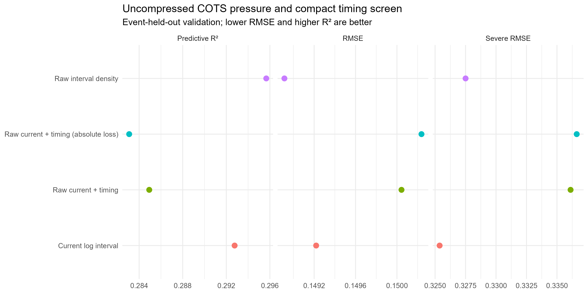
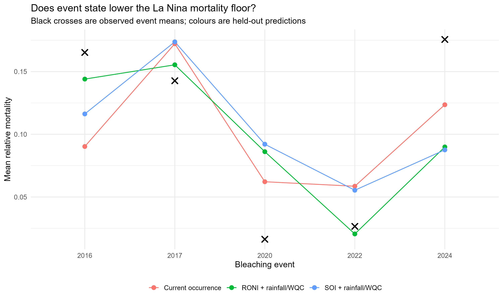
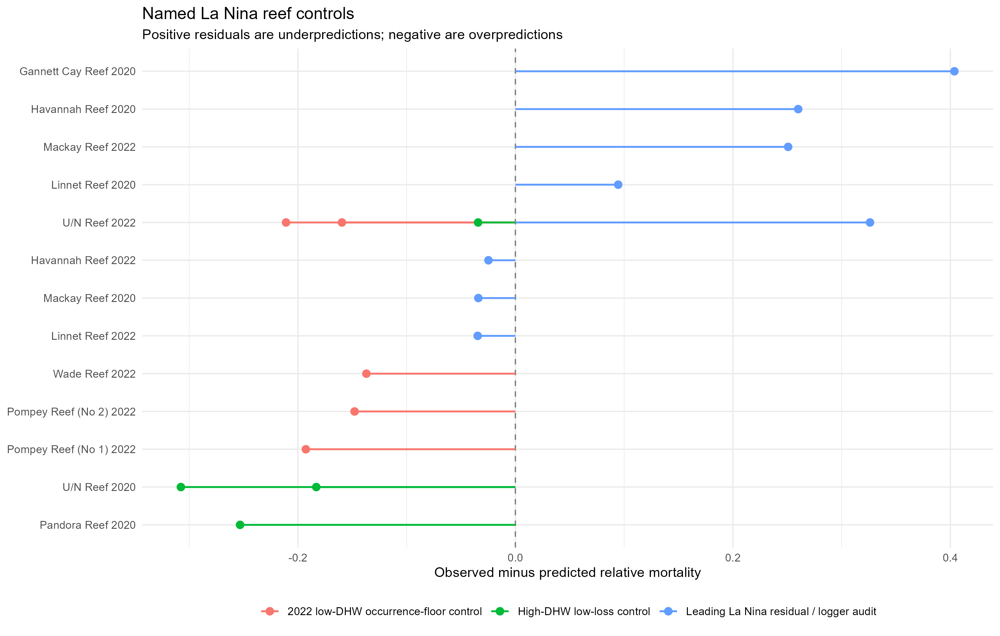

```{r}
suppressPackageStartupMessages({library(dplyr);library(readr);library(knitr);library(tidyr)})
source('../../src/lib/model_registry.R')
root <- project_root(); out <- file.path(root,'output','cots_raw_enso_occurrence')
cots <- read_csv(file.path(out,'cots_model_comparison.csv'),show_col_types=FALSE)
occ <- read_csv(file.path(out,'occurrence_model_comparison.csv'),show_col_types=FALSE)
oe <- read_csv(file.path(out,'occurrence_event_metrics.csv'),show_col_types=FALSE)
now <- read_csv(file.path(out,'nowcast_model_comparison.csv'),show_col_types=FALSE)
ne <- read_csv(file.path(out,'nowcast_event_metrics.csv'),show_col_types=FALSE)
early <- read_csv(file.path(out,'early_prevalence_summary.csv'),show_col_types=FALSE)
audit <- read_csv(file.path(out,'named_reef_audit.csv'),show_col_types=FALSE)
corr <- read_csv(file.path(out,'cots_compact_correlations.csv'),show_col_types=FALSE)
focal <- read_csv(file.path(out,'cots_focal_predictions.csv'),show_col_types=FALSE)
```

## Decision summary

The **raw interval COTS-density candidate is promoted** as the current aggregate best fit. Replacing log-compressed density with untransformed excess above 0.22 COTS/tow changes leave-one-event-out RMSE from `r sprintf('%.5f',cots$rmse[cots$candidate=='current_log_interval_selected'&cots$scheme=='leave_one_event_out'])` to `r sprintf('%.5f',cots$rmse[cots$candidate=='cots_raw_interval_relative'&cots$scheme=='leave_one_event_out'])`, and reef-blocked RMSE from `r sprintf('%.5f',cots$rmse[cots$candidate=='current_log_interval_selected'&cots$scheme=='reef_blocked_5fold'])` to `r sprintf('%.5f',cots$rmse[cots$candidate=='cots_raw_interval_relative'&cots$scheme=='reef_blocked_5fold'])`.

The gain is modest and does **not** solve Gannett 2020. Severe RMSE changes from `r sprintf('%.4f',cots$severe_rmse[cots$candidate=='current_log_interval_selected'&cots$scheme=='leave_one_event_out'])` to `r sprintf('%.4f',cots$severe_rmse[cots$candidate=='cots_raw_interval_relative'&cots$scheme=='leave_one_event_out'])`. The current-year pressure + time-since-peak candidate and its absolute-cover-loss version are rejected.

RONI/SOI plus rainfall and coloured-water anomaly also fail as initial occurrence corrections: they help 2022 but worsen 2020 and suppress 2024. A separate **sequential early-prevalence update** is promising on later reefs: RMSE changes from `r sprintf('%.4f',now$rmse[now$candidate=='Initial operational forecast'])` to `r sprintf('%.4f',now$rmse[now$candidate=='Sequential early-prevalence update'])`, and severe RMSE from `r sprintf('%.4f',now$severe_rmse[now$candidate=='Initial operational forecast'])` to `r sprintf('%.4f',now$severe_rmse[now$candidate=='Sequential early-prevalence update'])`.

## Current model contract

```{r}
#| results: asis
render_model_contract(root)
```

For the promoted COTS cause layer, $p_i$ is hindcast outbreak probability and $I_i$ is RRN density. The intensity predictor is

$$X_{COTS,i}=(I_i-0.22)_+,$$

on the original COTS-per-tow scale, alongside $p_i$, starting cover, Acropora, programme and geography. Historical COTS labels supervise training only. The interval maximum can include monitoring after event onset; a pressure nowcast is still required for prospective event-start deployment.

## COTS density and temporal-state screen

```{r}
labs <- c(current_log_interval_selected='Current log interval',cots_raw_interval_relative='Raw interval density',cots_raw_current_timing_relative='Raw current + time since peak',cots_raw_current_timing_absolute='Raw current + timing; absolute loss')
kable(cots|>mutate(candidate=recode(candidate,!!!labs))|>select(candidate,scheme,rmse,predictive_r2,severe_rmse,occurrence_brier,false_extreme_rate)|>mutate(across(where(is.numeric),~round(.x,4))),caption='Matched COTS validation. Raw interval density is selected; current-year temporal and absolute-loss candidates are rejected.')
```



The requested 9-versus-1 contrast is preserved, but the fitted effect is regularised by all labelled rows. At Gannett, 2020 current-year density is 0.84 COTS/tow and the retrospective interval maximum is 9.91. Removing log compression alone does not produce a severe-tail response.

```{r}
kable(focal|>filter(ReefID=='21-556',event_year==2020)|>mutate(candidate=recode(candidate,!!!labs))|>select(candidate,observed_mortality,predicted_mortality,cots_density_year,cots_interval_max,years_since_peak)|>mutate(across(where(is.numeric),~round(.x,3))),caption='Gannett Cay 2020 positive-control comparison.')
corr_long <- corr|>pivot_longer(-feature,names_to='feature_2',values_to='rho')|>filter(feature!=feature_2)|>arrange(desc(abs(rho)))|>slice_head(n=8)|>mutate(rho=round(rho,3))
kable(corr_long,caption='Largest correlations in the compact COTS block. Rejection is predictive, not caused by collinearity.')
```

## Initial La Nina occurrence-state screen

RONI and SOI were tested separately with shrinkage because they describe related climate state and only five events are available. ERA5 rainfall was reef-centred. WQC decadal delta is a coloured-water/runoff **proxy**, not measured discharge.

```{r}
kable(occ|>mutate(occurrence_candidate=recode(occurrence_candidate,occurrence_offset_only='Current occurrence',occurrence_roni_rain_wqc='RONI + rainfall/WQC',occurrence_soi_rain_wqc='SOI + rainfall/WQC'))|>select(occurrence_candidate,scheme,rmse,predictive_r2,severe_rmse,occurrence_brier)|>mutate(across(where(is.numeric),~round(.x,4))),caption='Initial-forecast occurrence candidates. Neither climate-index model is promoted.')
```



RONI lowers the 2022 mean prediction from `r sprintf('%.3f',oe$predicted_mean[oe$occurrence_candidate=='occurrence_offset_only'&oe$event_year==2022])` to `r sprintf('%.3f',oe$predicted_mean[oe$occurrence_candidate=='occurrence_roni_rain_wqc'&oe$event_year==2022])` near the observed `r sprintf('%.3f',oe$observed_mean[oe$event_year==2022][1])`. But it raises 2020 to `r sprintf('%.3f',oe$predicted_mean[oe$occurrence_candidate=='occurrence_roni_rain_wqc'&oe$event_year==2020])` and lowers 2024 to `r sprintf('%.3f',oe$predicted_mean[oe$occurrence_candidate=='occurrence_roni_rain_wqc'&oe$event_year==2024])` against observed `r sprintf('%.3f',oe$observed_mean[oe$event_year==2024][1])`.

## Sequential early-event update

The earliest 20% of unique surveyed reefs form a beta-shrunk prevalence signal and are excluded from scoring. This is a within-event nowcast, not the initial map.

```{r}
kable(early|>select(-early_reefs)|>mutate(across(where(is.numeric),~round(.x,3))),caption='Leakage-controlled early prevalence summaries.')
kable(ne|>select(candidate,event_year,rmse,predictive_r2,severe_rmse,occurrence_brier)|>mutate(across(where(is.numeric),~round(.x,3))),caption='Performance on later reefs only.')
```

The update substantially improves 2020 and severe-tail performance overall, has almost no effect in 2022, and slightly worsens 2017. It needs spatially separated validation and preferably aerial or rapid in-water prevalence rather than mortality observations collected months later.

## Named La Nina reef controls



```{r}
at <- audit|>group_by(control_group,ReefID,ReefName,event_year)|>summarise(programmes=paste(sort(unique(programme_key)),collapse=' + '),observed=mean(observed_mortality),predicted=mean(predicted_mortality),residual=mean(residual),DHW=mean(ann_maxdhw.x,na.rm=TRUE),logger_uplift=mean(local_first_correction,na.rm=TRUE),logger_source=first(correction_source),logger_km=mean(nearest_local_logger_km,na.rm=TRUE),starting_cover=mean(pre_cover_survey,na.rm=TRUE),Acropora=mean(prop_acropora_pre,na.rm=TRUE),WQC_percentile=mean(wqc_prior10_percentile,na.rm=TRUE),cloud=mean(cloudp_90,na.rm=TRUE),current=mean(mcur_90,na.rm=TRUE),.groups='drop')|>mutate(across(where(is.numeric),~round(.x,3)))|>arrange(control_group,desc(abs(residual)))
kable(at,caption='Named controls with logger, composition and environmental support.')
```

- **Gannett 2020** remains a cause-supported COTS magnitude miss; raw density worsens this positive control.
- **Havannah 2020** has direct positive local thermal correction, so the miss is not explained by NOAA overestimation.
- **Linnet 2020** has negative local correction while manta records loss and LTMP zero, pointing to observation/programme and composition support.
- **U/N 20-104 and Mackay 2022** remain positive residual controls. U/N 20-104 lacks supported local correction; Mackay has direct logger support.
- **U/N 11-049, U/N 11-162 and Pandora 2020** are high-DHW zero-loss controls. Pandora has a large positive direct correction, favouring protection/composition or cover-estimation explanations over insufficient heat.
- **U/N 21-139, Wade, Pompey and U/N 21-060 in 2022** remain clean occurrence-floor controls. Several have negative local thermal corrections, reinforcing uncertainty propagation rather than flattening magnitude.

## Limitations and next steps

This does not establish a causal ENSO effect. There are five events; 2020 is mixed/near-neutral in the available indices; rainfall is not catchment discharge; WQC is delayed; and the early-prevalence test is chronological but not spatially independent.


