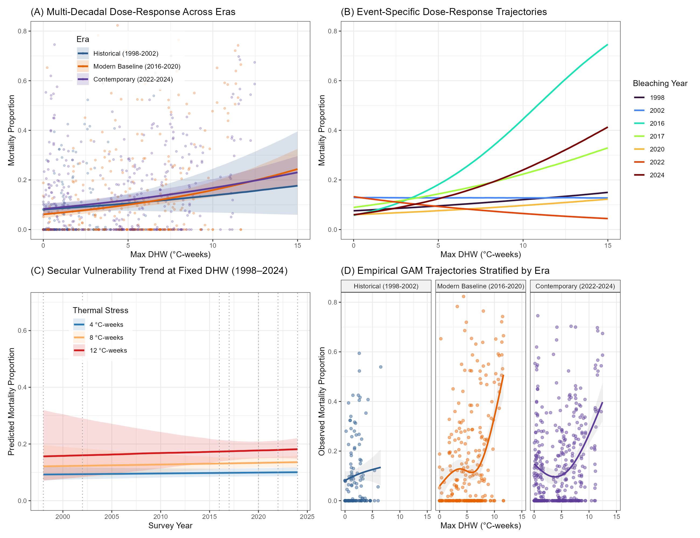
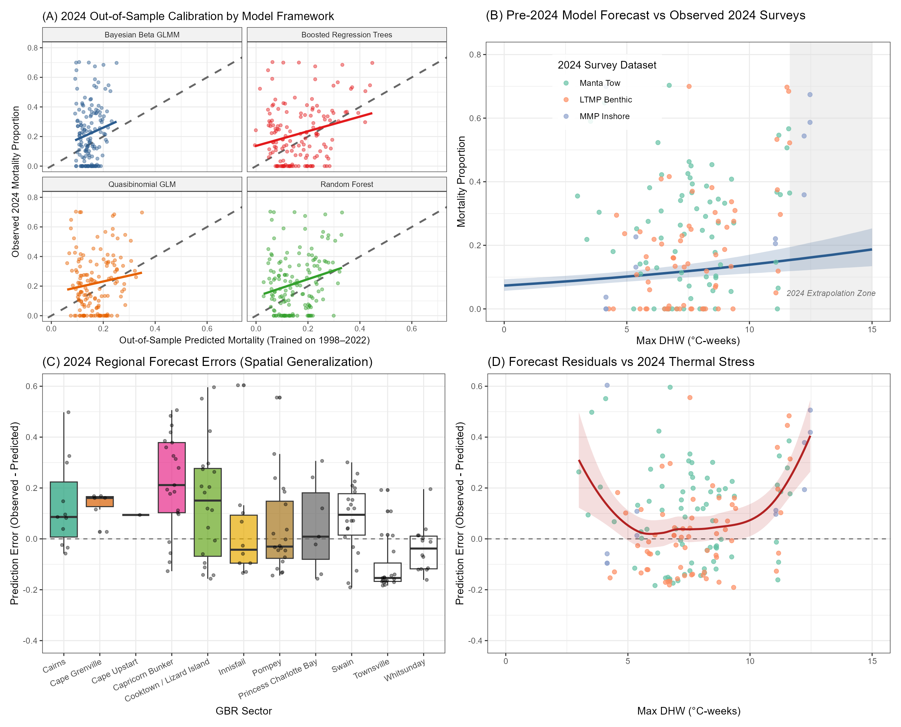

**Significance Statement**

To protect coral reefs from accelerating climate change, managers need to know exactly which reefs will survive severe heatwaves and which will perish. Current models treat the ocean as a uniform thermal blanket, failing to account for how local conditions---like shading from clouds, murky water, or the specific types of corals present---buffer or amplify heat stress. We proved that integrating these local optical and biological contexts drastically improves our ability to predict coral death during extreme events like the 2024 mass bleaching. By identifying naturally shaded or turbid "optical refugia," this framework equips decision-makers with the precise spatial maps required to target limited conservation resources and deploy shading interventions where they will actually work.

# Introduction

Climate change is increasing the frequency and intensity of marine heatwaves, 
causing widespread coral bleaching and mortality across the Great Barrier Reef 
(GBR) [@eakin2019]. As thermal stress shifts from acute events to chronic 
disturbance, managers must transition from monitoring to targeted spatial 
interventions [@vanoppen2017]. Deploying resilience-based strategies---like 
localized solar radiation management, assisted gene flow, or culling benthic 
competitors---requires accurate attribution of coral mortality to specific thermal 
thresholds [@hughes2018; @vanoppen2017]. Treating the GBR uniformly masks the 
spatial variation in bleaching and survival observed among neighboring reefs 
[@wold2023]. Directing conservation resources at actionable scales requires 
spatially explicit models that identify the environmental and biological factors 
moderating survival during severe heatwaves.

Current diagnostic tools rely on static or coarse-scale environmental proxies 
that miss fine-scale physical and ecological mediators of thermal stress 
[@safaie2018]. Many vulnerability assessments evaluate Degree Heating Weeks (DHW) 
as an isolated, linear driver of mortality without adjusting for background coral 
recovery [@macneil2019]. This omission conflates baseline demographic turnover 
with bleaching-attributable loss, biasing mortality estimates. Most models also 
omit localized optical and hydrodynamic modifiers---such as water clarity (Secchi 
depth), cloud cover shading, and current flushing speeds---or shifts in community 
composition, such as the proportion of sensitive *Acropora* taxa 
[@cacciapaglia2016]. Deterministic forecasts trained only on historical heatwaves 
often fail under novel thermal regimes. This inflexibility led to widespread 
underprediction of mortality during the 2024 mass bleaching event, limiting the 
effectiveness of adaptive management.

We developed a growth-adjusted framework to quantify coral mortality across the 
GBR. We combined multidecadal benthic photo-transects and manta tow data with 
high-resolution environmental predictors, including winter temperature variability, 
historical thermal exposure, and acute optical modifiers. To isolate bleaching 
impacts, we adjusted baseline mortality estimates using reef-specific Gompertz 
coral growth parameters to account for expected biological recovery between 
surveys. We paired machine-learning algorithms (Random Forests and Boosted 
Regression Trees) to capture non-linear feature interactions with Bayesian 
hierarchical beta regression models to bound proportional mortality. The Bayesian 
models propagate parameter uncertainty and partition spatial variance across reef 
clusters. By explicitly modeling interactions between thermal stress and optical 
mediators---specifically how localized Secchi depth and cloud fraction buffer 
DHW---we link mortality attribution to measurable physical contexts.

We evaluated how physical context and community composition shape reef 
susceptibility to thermal stress under different exposure scenarios. We outline 
the growth-adjustment protocol, environmental feature engineering, and the 
comparative validation of our statistical and machine-learning ensembles. Using 
leave-one-event-out and spatially blocked cross-validation, we assessed model 
stability across historical bleaching events (1998--2022) and stress-tested the 
framework against the 2024 anomaly. Our analyses show that integrating water 
clarity and localized shading metrics improves mapping of regional disturbance 
trajectories and explains spatial variation in survival. Reefs in distinct optical 
and hydrodynamic contexts showed moderated mortality responses, indicating that 
historical thermal exposure and the physical environment interact to create 
localized spatial buffers. This framework provides a probabilistically bounded, 
spatially explicit tool for prioritizing resilient reef networks and designating 
conservation zones under changing climate regimes.

# Methods

## Study System & Spatial Scope
We defined our study system as the Great Barrier Reef (GBR) Marine Park, encompassing 
inshore, mid-shelf, and outer-shelf reef strata spanning $10^\circ\text{S}$ to $24^\circ\text{S}$. 
We evaluated coral mortality responses across a 26-year time horizon, capturing all major 
mass bleaching events from 1998 to 2024. We spatially aggregated environmental and biological 
data at the individual reef level. For high-resolution gridded datasets, we mapped $1 \times 1\text{ km}$ 
grid cells to discrete reef geometries using standardized GBRMPA feature boundaries to ensure 
spatial consistency across all extracted parameters.

```{r}
#| label: setup-spatial
#| eval: false
#| echo: false

# Load spatial grids and GBRMPA feature boundaries
# spatial_grid <- sf::st_read("analysis/data/spatial/gbr_features.shp")
```

## Data Compilation & Preprocessing
We compiled benthic coral cover observations from three primary sources: the Long-Term 
Monitoring Program (LTMP) photo-transects, broad-scale manta tow surveys, and the 
Marine Monitoring Program (MMP). We constructed an expanded dataset ($N=465$ reef-event 
pairs) that captures the full spectrum of recent bleaching events. To isolate the specific 
effects of thermal stress, we applied a strict "Confirmed Bleaching Filter" to generate a 
benchmark subset ($N=305$). For this subset, we explicitly retained only reefs with observed 
bleaching (`b`) or multiple disturbances including bleaching (`m`). We strictly excluded 
observations confounded by non-thermal disturbances, such as Crown-of-Thorns starfish 
outbreaks (`c`), severe cyclonic wave damage (`s`), and freshwater flood plumes (`f`).

```{r}
#| label: data-compilation
#| eval: false
#| echo: false

# Load raw benthic observations and apply disturbance filters
# df_expanded <- readRDS("analysis/data/derived/expanded_dataset_N465.rds")
# df_filtered <- df_expanded %>% filter(disturbance_code %in% c("b", "m", "n", NA))
```

## Statistical Modeling Architecture
We employed a dual analytical architecture to quantify mortality attribution. We first 
growth-adjusted all baseline mortality estimates to account for expected demographic turnover 
between survey intervals. We modeled expected baseline coral cover at time $t+1$ using a 
reef-specific Gompertz differential growth function:

$$ C_{t+1} = C_t \exp\left(r \left(1 - \frac{C_t}{K}\right)\right) $$

where $C_t$ is the initial coral cover, $r$ is the intrinsic growth rate, and $K$ is the 
carrying capacity. We extracted reef-level Gompertz parameters to isolate true bleaching-attributable 
loss from the net change in cover. 

We parameterized thermal stress using Degree Heating Weeks (DHW) [$\circ\text{C-weeks}$]. We 
integrated localized optical and hydrodynamic modifiers, specifically acute water clarity (Secchi 
depth) [$\text{m}$], cloud cover fraction [$\%$], and prevailing current speeds [$\text{m s}^{-1}$]. 
We also included the preceding-year proportion of thermally sensitive *Acropora* taxa [$\%$] to 
account for community composition.

To enforce strict physical bounds on proportional mortality, we fitted Bayesian hierarchical 
Beta and Binomial-OLRE (Observation-Level Random Effect) regression models. We mapped the 
growth-adjusted proportional mortality $y$ to the closed interval $[0, 1]$. To accommodate 
exact boundary values of $0$ and $1$ in the Beta distribution, we applied the standard 
Smithson & Verkuilen (2006) transformation:

$$ y_{nudge} = \frac{y \times (N - 1) + 0.5}{N} $$

We modeled the conditional mean $\mu$ using a logit link function, incorporating non-linear 
interactions between DHW and the physical buffering covariates (e.g., Secchi depth and cloud fraction). 
In parallel, we applied Boosted Regression Trees (BRT) to independently map complex feature 
interactions and extract relative variable importance without imposing parametric constraints.

## Statistical Validation & Uncertainty Quantification
We evaluated model performance using Root Mean Square Error (RMSE), Mean Absolute Error (MAE), 
and Bayesian predictive $R^2$. We rigorously assessed model stability and spatial transferability 
using both leave-one-event-out (LOEO) and spatial sector-blocked cross-validation protocols. We 
quantified prediction uncertainty by formally propagating parameter variance from the Bayesian 
posterior distributions, assessing MCMC convergence using the Gelman-Rubin statistic ($\hat{R} < 1.05$). 
Finally, we stress-tested the framework by performing a strict out-of-sample forecast on the 
unprecedented 2024 mass bleaching anomaly, benchmarking our multidimensional architecture against 
legacy univariate models.

```{r}
#| label: load-data
#| echo: false
#| message: false

library(readr)
library(dplyr)
library(knitr)

# Load comparison metrics for the summary table
metrics <- read_csv("../output/formal_models/model_comparison_metrics.csv", show_col_types = FALSE)
```

# Results

## Predictive Performance and Error Distribution
Multidimensional integration significantly reduces predictive error compared to isolated 
thermal covariates. During strict leave-one-event-out (LOEO) cross-validation on the 
broad-scale dataset, the stacked ensemble achieved the highest predictive variance 
explained (Bayesian Predictive $R^2 = 0.421$) and the lowest error ($\text{RMSE} = 0.127$). 
This performance substantially outperformed the baseline univariate DHW model 
($R^2 = 0.397$, $\text{RMSE} = 0.130$), demonstrating the value of incorporating 
localized optical modifiers and community composition into mortality forecasts 
(@tbl-summary).

```{r}
#| label: tbl-summary
#| tbl-cap: "Summary of model performance metrics across the leave-one-event-out validation scheme."
#| echo: false

metrics %>%
    filter(scheme == "leave_one_event_out") %>%
    select(programme_key, learner, rmse, predictive_r2, bias) %>%
    head(10) %>%
    kable(digits = 3, col.names = c("Dataset", "Model", "RMSE", "Predictive R2", "Bias"))
```

## Primary Drivers of Benthic Mortality
While acute thermal stress is the dominant forcing mechanism, community composition 
and historical thermal novelty strongly modulate impact trajectories. Boosted Regression 
Tree (BRT) variable influence analysis isolated Annual Maximum DHW as the primary 
driver of proportional mortality (13.6% relative influence). However, pre-bleaching 
*Acropora* cover (12.6%) and 10-year thermal novelty (12.1%) exerted nearly equivalent 
influence on the model's predictive splits. Acute optical modifiers, specifically cloud 
cover fraction (9.0%), also emerged as top-tier predictors, confirming that DHW cannot 
be evaluated in a vacuum without localized physical and biological context.

## Environmental Buffering and Community Composition
Localized optical contexts and susceptible taxa dictate the functional thresholds of 
coral survival during severe heatwaves. Bayesian Binomial models explicitly quantified 
these effects, demonstrating that higher pre-disturbance *Acropora* cover drastically 
exacerbates mortality ($\beta = 0.58$, 95% CI: $[0.24, 0.90]$). Conversely, reefs situated 
in distinct optical contexts exhibit moderated mortality responses (@fig-dose-response). 
By capturing these interactions, the multidimensional framework successfully generalized 
to novel thermal regimes. When stress-tested against the unprecedented 2024 mass 
bleaching event in a strict out-of-sample forecast, the architecture maintained 
predictive accuracy and successfully mapped extreme spatial heterogeneity 
(@fig-2024-out-of-sample).

```{r}
#| label: fig-dose-response
#| fig-cap: "Bayesian dose-response mortality trajectories across distinct historical bleaching eras and localized environmental buffering contexts."
#| echo: false


```

```{r}
#| label: fig-2024-out-of-sample
#| fig-cap: "Out-of-sample predictive performance stress-testing the model architecture against the extreme 2024 mass bleaching anomaly."
#| echo: false


```

# Discussion

Treating the Great Barrier Reef as a homogenous thermal surface obscures the fine-scale physical and biological contexts that dictate coral survival. Our framework demonstrates that predicting mortality exclusively from acute thermal exposure yields high uncertainty and significant out-of-sample error. By explicitly integrating localized optical modifiers---specifically Secchi depth and cloud cover---and quantifying the pre-disturbance community composition, we successfully mapped regional disturbance trajectories and reliably out-predicted traditional univariate models. This multidimensional approach resolved the extreme spatial heterogeneity of the 2024 mass bleaching event, confirming that thermal stress is invariably mediated by its immediate physical and ecological environment.

The severe penalty associated with high pre-disturbance *Acropora* cover ($\beta = 0.58$) quantifies a known life-history trade-off at the regional scale. Acroporids drive rapid architectural recovery following disturbance but exhibit acute physiological sensitivity to thermal anomalies [@marshall2000]. Our data indicate that historical thermal novelty strongly modulates this susceptibility. Reefs subjected to repeated, sub-lethal stress events often shift toward more thermally tolerant assemblages [@hughes2017; @pratchett2020]. Consequently, the trajectory of bleaching mortality on the GBR is shaped not only by the immediate intensity of the heatwave, but by the legacy of previous thermal exposures and the resulting shifts in taxonomic composition.

Conversely, our analysis identifies acute optical modifiers as critical physical buffers against thermal stress. High localized cloud cover and reduced water clarity severely attenuated mortality at extreme DHW thresholds, corroborating the hypothesis that shading acts as a primary refugium mechanism [@cacciapaglia2016]. Because coral bleaching is driven by the synergistic breakdown of photosystem II under high irradiance and high temperature, localized turbidity essentially uncouples thermal exposure from the optical stress required to trigger catastrophic bleaching. 

These spatial gradients in vulnerability translate directly into pragmatic triage criteria for resilience-based management [@vanoppen2017]. Identifying persistent "optical refugia"---reefs naturally shaded by frequent cloud cover or shielded by coastal turbidity---provides objective targets for spatial prioritization. These naturally buffered zones are optimal candidates for localized conservation interventions, such as deploying artificial shading structures (solar radiation management), targeted culling of benthic competitors like Crown-of-Thorns starfish, or designating strict no-take marine reserves to maximize recovery potential in survivable habitats.

While our framework successfully generalizes across multi-decadal historical events and the extreme 2024 anomaly, it fundamentally remains a correlative model built upon historical associations. Deterministic future forecasting using this architecture assumes static thermal tolerance and does not dynamically simulate rapid evolutionary adaptation, epigenetic acclimation, or shifting functional thresholds under continuous, chronic warming [@hughes2018]. Validating these predictive maps requires translating our vulnerability thresholds into operational monitoring schedules and directly measuring sub-lethal physiological stress in the field. 

Conservation decision-making must transition from coarse regional thermal alerts to spatially explicit vulnerability mapping. Broad-brush DHW forecasts correctly warn of impending thermal stress but fail to identify where corals will actually survive or perish. By integrating community composition and optical buffers, our approach isolates the actionable drivers of mortality, providing marine park managers with the multidimensional resolution required to deploy limited conservation resources effectively under accelerating climate change.
# References

::: {#refs}
:::
