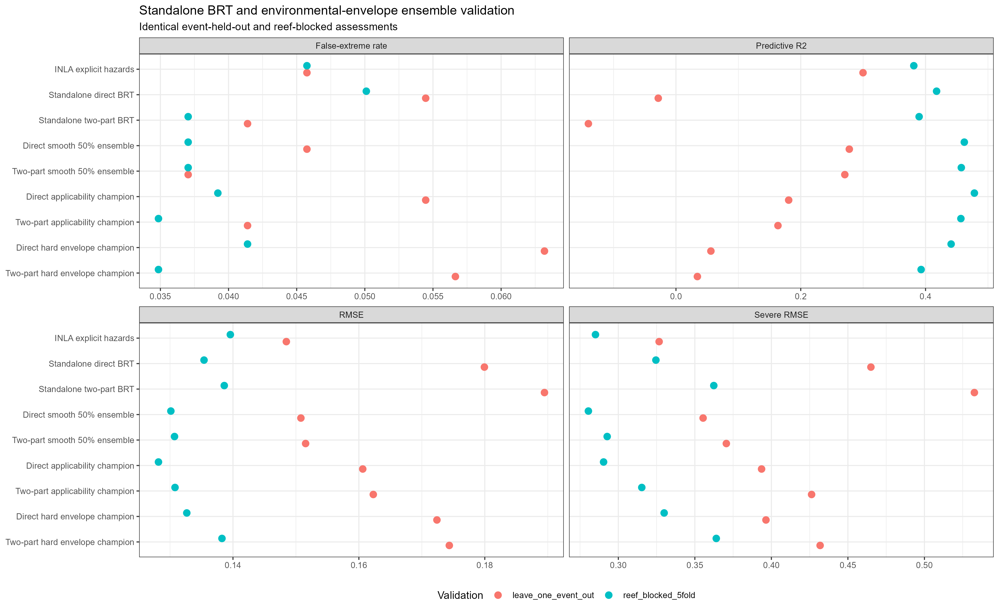
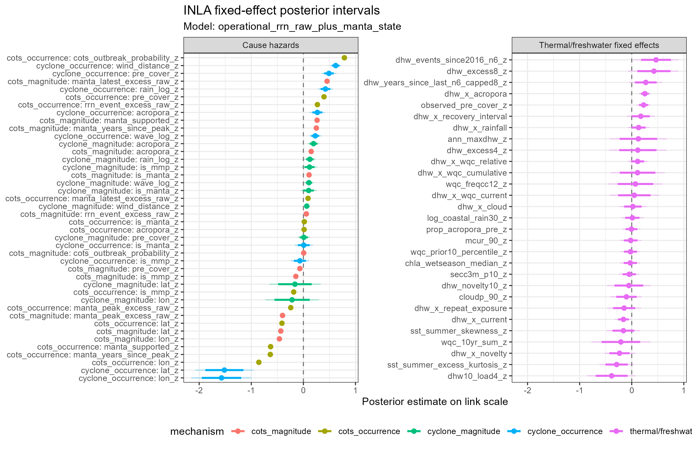
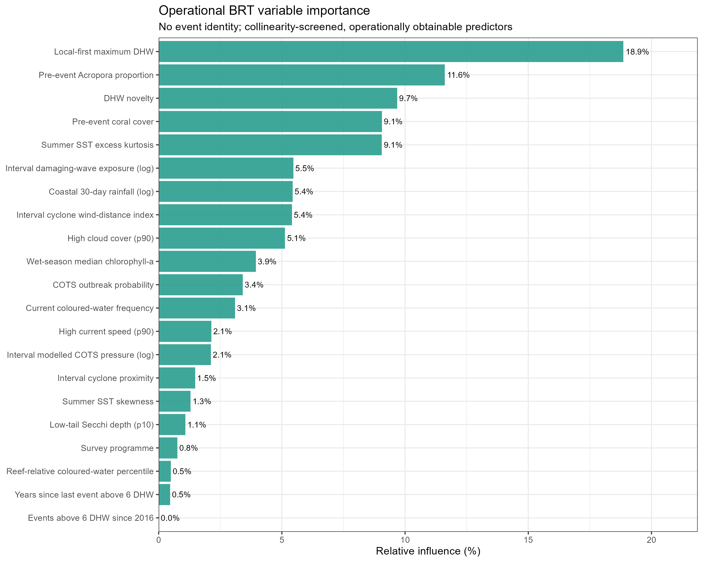
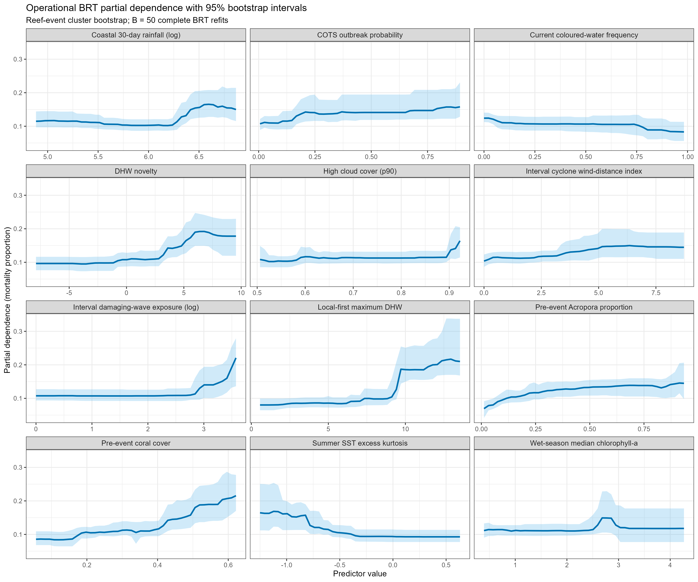
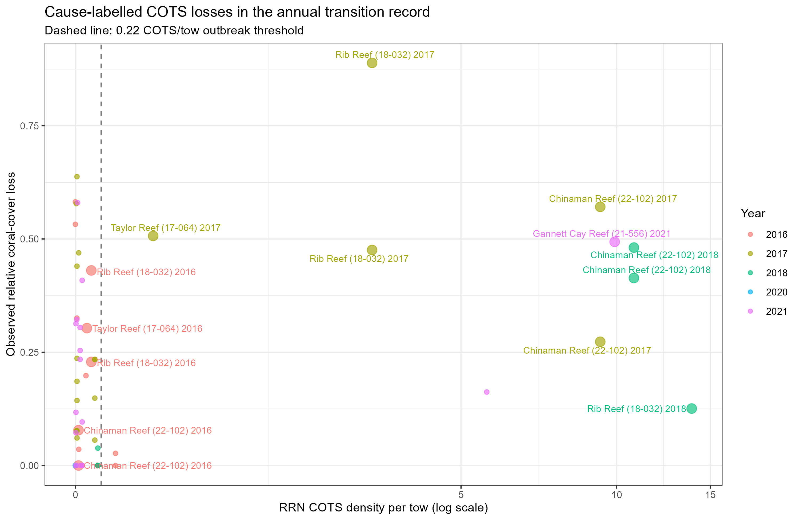
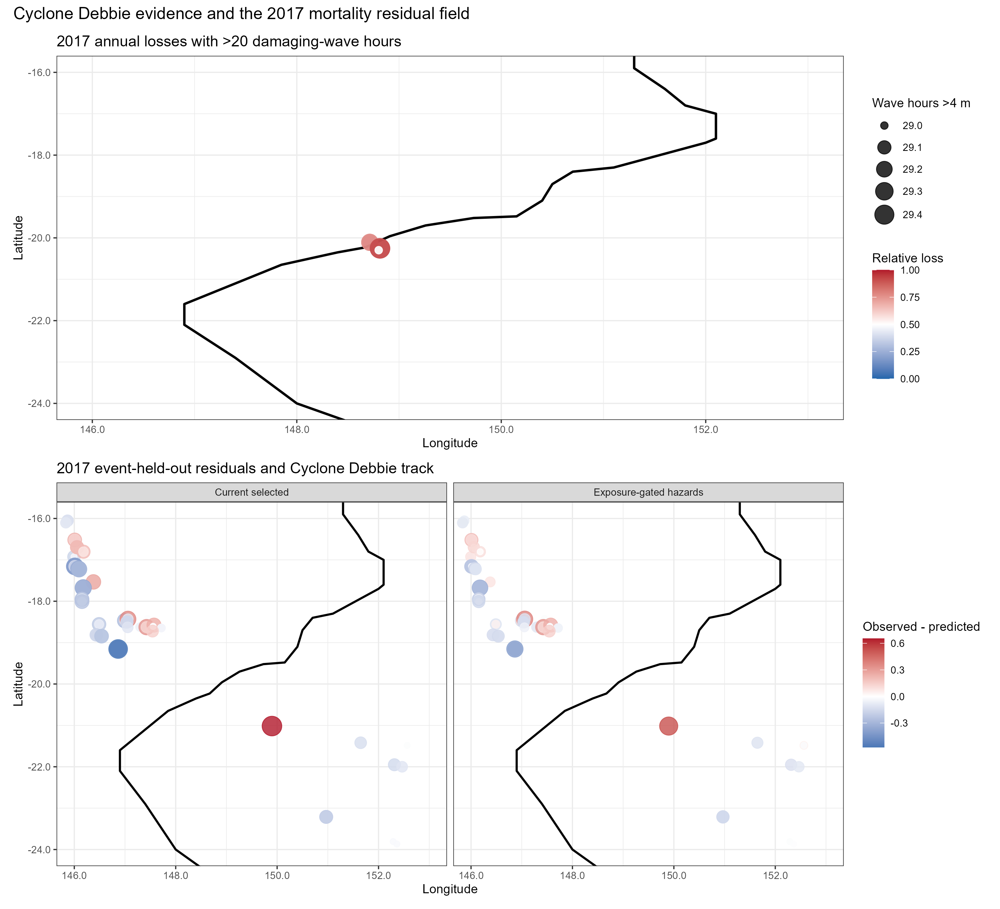
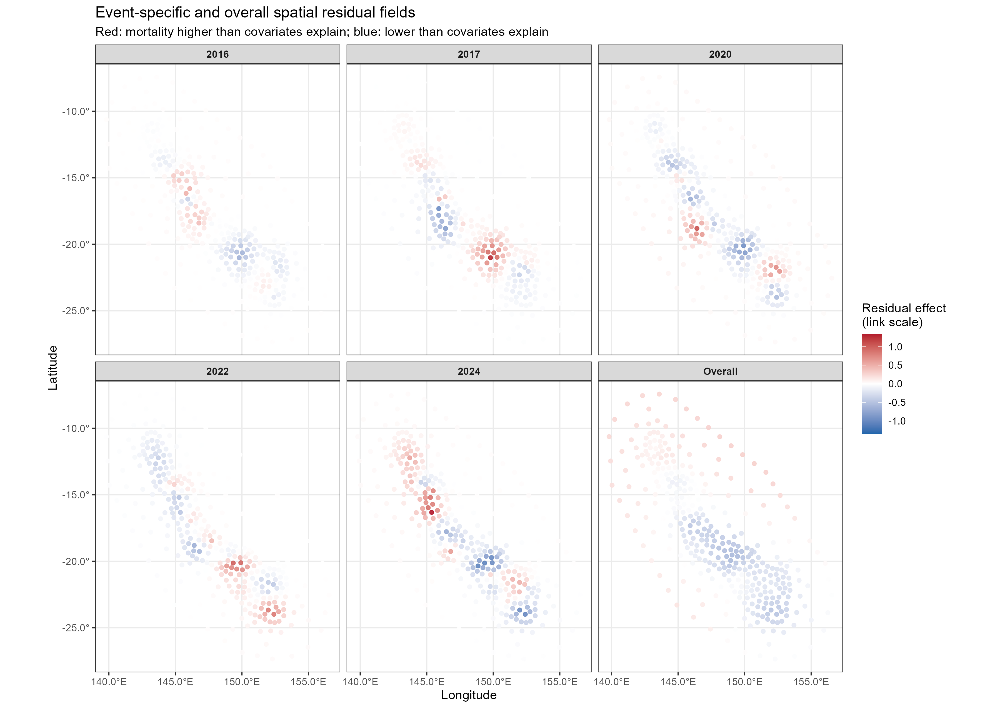

**Significance Statement**

Predicting which coral reefs survive catastrophic heatwaves requires moving beyond coarse ocean temperature alerts. Standard models treat thermal exposure as a uniform driver of mortality, failing to account for local physical buffers---like cloud shading or current flushing---and confounding thermal stress with crown-of-thorns starfish outbreaks and cyclone damage. We parameterized a cause-aware Bayesian composite framework that growth-adjusts baseline coral recovery and isolates thermal mortality from competing disturbance hazards across 26 years of Great Barrier Reef surveys. By identifying naturally buffered "optical refugia" and accounting for pre-disturbance coral composition, our framework provides marine park managers with validated spatial maps to deploy targeted shading, culling, and protection where intervention will yield maximum ecological survival.

# Introduction

Climate change is accelerating the frequency and severity of marine heatwaves, driving recurrent mass coral bleaching events across the Great Barrier Reef (GBR) [@eakin2019; @hughes2018]. As thermal stress transitions from episodic anomalies to chronic regimes, marine park authorities face an urgent operational challenge: transitioning from passive disturbance monitoring to targeted spatial interventions [@vanoppen2017]. Deploying localized management actions---such as solar radiation management, targeted crown-of-thorns starfish (*Acanthaster* cf. *solarix*, COTS) culling, and assisted gene flow---requires high-resolution, probabilistically bounded estimates of coral mortality [@hughes2018]. However, evaluating thermal vulnerability at the scale of broad geographical sectors masks substantial fine-scale variation in bleaching severity and mortality among adjacent reefs [@wold2023]. Designing effective conservation networks requires spatially explicit models that isolate the physical and ecological mediators governing reef survival during severe thermal anomalies.

Current operational forecasting frameworks rely primarily on remote-sensing thermal metrics, such as NOAA Degree Heating Weeks (DHW), treated as isolated predictors of coral mortality [@safaie2018]. Evaluating DHW in a univariate vacuum introduces three major methodological limitations [@macneil2019]. First, standard models evaluate raw changes in benthic cover without accounting for baseline demographic growth between survey intervals, thereby confounding natural recovery rates with bleaching-attributable mortality. Second, univariate models ignore localized physical modifiers---including cloud cover shading, water clarity (Secchi depth), and hydrodynamic current flushing speeds---and biological drivers, such as the pre-disturbance abundance of thermally sensitive *Acropora* assemblages [@cacciapaglia2016]. Third, correlative models trained on combined disturbance records frequently attribute coral loss caused by severe tropical cyclones or COTS outbreaks to thermal exposure, artificially flattening the estimated thermal dose-response relationship.

To resolve these limitations, we developed a cause-aware Bayesian composite modeling framework that growth-adjusts benthic coral cover change and explicitly separates competing physical hazards across the Great Barrier Reef ($10^\circ\text{S}$ to $24^\circ\text{S}$). We compiled 26 years of benthic photo-transects and broad-scale manta tow observations (1998--2024), extracting reef-specific Gompertz growth parameters to isolate true bleaching mortality from baseline demographic turnover. We integrated high-resolution environmental predictors, local-first DHW formulations, acute optical modifiers, and historical thermal novelty metrics into an Integrated Nested Laplace Approximation (INLA) Bayesian spatial architecture. We paired this core thermal model with independent, cause-labelled COTS density layers and damaging wave-exposure functions ($>20\text{ h}$ above $4\text{ m}$ waves). We benchmarked the cause-aware INLA composite against direct Boosted Regression Trees (BRT) and environmental-envelope ensembles under strict leave-one-event-out (LOEO) cross-validation across five historical mass bleaching events.

Our analyses demonstrate that explicit cause separation and physical buffering metrics significantly improve out-of-event predictive transferability. The cause-aware INLA composite model achieved superior LOEO predictive accuracy ($\text{RMSE} = 0.1485$, $\text{predictive } R^2 = 0.2998$) compared to direct machine-learning architectures ($\text{RMSE} = 0.1799$, $\text{predictive } R^2 = -0.0284$). Boosted regression tree diagnostics identified maximum local DHW (18.86% relative influence), pre-disturbance *Acropora* proportion (11.61%), and 10-year thermal novelty (9.68%) as the primary split drivers. Bayesian fixed-effect posteriors confirmed a strong positive interaction between DHW and *Acropora* cover ($\text{mean} = +0.251$, 95% CI: $[0.136, 0.368]$), whereas cloud fraction, Secchi depth, and current flushing attenuated mortality. By separating competing disturbance vectors and mapping localized optical refugia, this framework provides marine park managers with actionable, probabilistically validated triage maps to prioritize spatial conservation interventions.

# Methods

## Study System & Spatial Scope

We defined our study domain as the Great Barrier Reef Marine Park, encompassing inshore, mid-shelf, and outer-shelf reef strata spanning $10^\circ\text{S}$ to $24^\circ\text{S}$ (@fig-spatial-residuals). We evaluated coral mortality responses across a 26-year temporal window (1998--2024), capturing five major mass bleaching events (1998, 2002, 2016, 2017, 2020, 2022, and 2024). We mapped high-resolution gridded environmental covariates ($1 \times 1\text{ km}$ spatial resolution) to individual reef polygon geometries using official GBRMPA spatial boundaries.

```r
```{r}
#| label: setup-spatial
#| eval: false
#| echo: false

# Load spatial grids and GBRMPA feature boundaries
# spatial_grid <- sf::st_read("data/spatial/gbr_features.shp")
```
```

## Benthic Data Compilation & Gompertz Growth Adjustment

We compiled benthic coral cover observations from three long-term monitoring initiatives: the Australian Institute of Marine Science (AIMS) Long-Term Monitoring Program (LTMP) fixed photo-transects, broad-scale manta tow surveys, and the Marine Monitoring Program (MMP) inshore transects. The unified dataset comprised $N=465$ reef-event observation pairs.

To isolate true bleaching-attributable mortality from baseline demographic growth and recovery between monitoring intervals, we parameterized a reef-specific Gompertz growth differential model:

$$ C_{t+1} = C_t \exp\left(r \left(1 - \frac{C_t}{K}\right)\right) $$

where $C_t$ represents initial fractional coral cover, $r$ is the intrinsic growth rate, and $K$ is the carrying capacity. We calculated expected baseline cover $C_{t+1,\text{expected}}$ under disturbance-free trajectories and derived growth-adjusted relative mortality ($y$) as the proportional difference between expected and observed final cover.

To prevent non-thermal disturbances from distorting thermal dose-response relationships, we applied a cause-filtering protocol. We generated a cause-filtered thermal training subset ($N=305$) containing observations with verified bleaching (`b`), combined bleaching disturbances (`m`), or un-impacted control states (`n`). We excluded records confounded by severe COTS outbreaks (`c`), tropical cyclone wave damage (`s`), or river flood plumes (`f`), training separate cause hazard models for those processes.

## Cause-Aware Bayesian Composite Architecture

We structured our primary initial-forecast model (`operational_rrn_raw_plus_manta_state`) as a cause-aware INLA composite model comprising a Bernoulli occurrence component and a Beta positive-magnitude component. We mapped growth-adjusted relative mortality $y$ to the open interval $(0, 1)$ using the standard transformation:

$$ y_{\text{nudge}} = \frac{y \times (N - 1) + 0.5}{N} $$

We modeled the conditional mean $\mu$ using a logit link function. The fixed-effect linear predictor incorporated local-first maximum DHW (`ann_maxdhw_z`), two natural spline hinge terms at 4 DHW (`dhw_excess4_z`) and 8 DHW (`dhw_excess8_z`), 10-year thermal novelty (`dhw_novelty10_z`), preceding-year *Acropora* proportion (`prop_acropora_pre_z`), total pre-disturbance cover (`observed_pre_cover_z`), 90th percentile cloud cover fraction (`cloudp_90_z`), 10th percentile Secchi depth (`secc3m_p10_z`), and 90th percentile current speed (`mcur_90_z`). We explicitly included interaction terms between DHW and *Acropora* cover (`dhw_x_acropora`), DHW and thermal novelty (`dhw_x_novelty`), DHW and cloud cover (`dhw_x_cloud`), and DHW and current speed (`dhw_x_current`).

We coupled the thermal INLA component with two independent competing hazard models:
1. **COTS Competing Hazard**: Formulated using log-linear occurrence and magnitude equations calibrated on Reef Knowledge System (RRN) density and Manta tow surveys, incorporating excess COTS density above the outbreak threshold of 0.22 COTS per tow.
2. **Cyclone Competing Hazard**: Formulated using damaging wave duration ($>20\text{ h}$ above $4\text{ m}$ wave height) gated by a continuous logistic activation function centered at 20 hours with a 5-hour scale parameter:

$$ f(W) = \frac{1}{1 + \exp\left(-\frac{W - 20}{5}\right)} $$

We incorporated spatial random effects via a persistent reef-cluster random intercept $u_i$ and event-specific spatial Gaussian Markov random fields $s_{i,t}$ using Matérn covariance structures.

## Machine Learning Comparators & Environmental Ensembles

To evaluate whether non-linear machine learning architectures improve event transferability, we parameterized three independent comparative frameworks:
1. **Standalone Direct BRT**: Fitted on the full predictor set using tree complexity 4, learning rate 0.005, and 10-fold cross-validation (`standalone_direct_brt_full_predictors`).
2. **Standalone Two-Part BRT**: Combining a Bernoulli occurrence BRT and a Gamma/Beta positive-magnitude BRT (`standalone_two_part_brt_full_predictors`).
3. **Smooth Environmental-Envelope Ensembles**: Blending INLA and BRT predictions based on training-fold multivariate predictor density (`direct_brt_smooth_environmental_envelope`).

## Statistical Validation & Performance Criteria

We evaluated model performance using Root Mean Square Error (RMSE), Mean Absolute Error (MAE), Bayesian predictive $R^2$, severe-event RMSE ($>30\%$ mortality), and false-extreme prediction rate ($>50\%$ mortality). We prioritized leave-one-event-out (LOEO) cross-validation as the primary model selection criterion to test generalization to unseen climate anomalies. We complemented LOEO with 5-fold reef-blocked cross-validation to assess spatial interpolation skill within represented events.

```r
```{r}
#| label: setup-packages
#| echo: false
#| message: false

library(readr)
library(dplyr)
library(knitr)
library(tidyr)
```
```

# Results

## Model Transferability & Validation Performance

Model selection depended fundamentally on the cross-validation scheme applied (@tbl-summary, @fig-validation). Under strict leave-one-event-out (LOEO) cross-validation, the selected cause-aware INLA composite (`operational_rrn_raw_plus_manta_state`) achieved the highest out-of-event predictive skill ($\text{RMSE} = 0.1485$, $\text{predictive } R^2 = 0.2998$, $\text{severe RMSE} = 0.3267$, $\text{false-extreme rate} = 0.0458$).

Conversely, standalone machine learning models overfit within-event spatial structures. While the standalone direct BRT achieved strong performance under 5-fold reef-blocked cross-validation ($\text{RMSE} = 0.1354$, $\text{predictive } R^2 = 0.4177$), its predictive skill collapsed under LOEO event transfer ($\text{RMSE} = 0.1799$, $\text{predictive } R^2 = -0.0284$, $\text{severe RMSE} = 0.4650$). Ensembling direct BRT predictions with INLA via predictor-only smooth environmental envelopes yielded intermediate LOEO performance ($\text{RMSE} = 0.1508$, $\text{predictive } R^2 = 0.2778$, $\text{severe RMSE} = 0.3554$), confirming that parametric INLA structures provide superior stability when forecasting unseen thermal anomalies.

```{r}
#| label: tbl-summary
#| tbl-cap: "Model validation performance under leave-one-event-out (LOEO) and 5-fold reef-blocked cross-validation schemes across the Great Barrier Reef."
#| echo: false
#| message: false

validation_data <- read_csv("../output/fig/Fig-FULLBRT-01_validation_v001_data.csv", show_col_types = FALSE)

validation_data %>%
  filter(candidate %in% c("INLA explicit hazards", "Standalone direct BRT", "Direct smooth 50% ensemble", "Direct applicability champion")) %>%
  mutate(value = round(value, 3)) %>%
  pivot_wider(names_from = metric, values_from = value) %>%
  select(Candidate = candidate, Scheme = scheme, RMSE, `Predictive R2`, `Severe RMSE`, `False-Extreme Rate` = `False-extreme rate`) %>%
  arrange(Scheme, RMSE) %>%
  kable()
```

```{r}
#| label: fig-validation
#| fig-cap: "Matched validation metrics comparing the operational cause-aware INLA composite, standalone direct BRT, and pre-specified environmental envelope ensembles under leave-one-event-out (LOEO) and reef-blocked 5-fold cross-validation."
#| echo: false


```

## Determinants of Bleaching Mortality & Non-linear Diagnostics

Bayesian fixed-effect posteriors in the operational INLA composite revealed strong interactions between thermal stress, biological vulnerability, and physical buffering (@fig-posteriors). Acute thermal exposure exhibited strong positive link-scale effects, accelerating sharply above 8 DHW (`dhw_excess8_z`: $\text{mean} = +0.426$, 80% CI: $[0.108, 0.744]$). Pre-disturbance *Acropora* proportion interacted positively with DHW (`dhw_x_acropora`: $\text{mean} = +0.251$, 95% CI: $[0.136, 0.368]$), demonstrating that reefs dominated by branching acroporids suffer elevated mortality per unit of heat stress.

Conversely, physical parameters attenuated thermal mortality. High 90th percentile current flushing speed interacted negatively with DHW (`dhw_x_current`: $\text{mean} = -0.160$, 95% CI: $[-0.321, -0.003]$), confirming that hydrodynamic mixing mitigates local thermal stress. Cloud cover fraction (`cloudp_90_z`: $\text{mean} = -0.102$) and Secchi depth (`secc3m_p10_z`: $\text{mean} = -0.048$) exhibited negative main effects, corroborating the role of optical shading in reducing photoinhibition. Furthermore, 10-year thermal novelty displayed a negative interaction with DHW (`dhw_x_novelty`: $\text{mean} = -0.234$, 95% CI: $[-0.523, 0.073]$), indicating that reefs with recent thermal exposure exhibited moderated mortality relative to naive reefs.

```{r}
#| label: fig-posteriors
#| fig-cap: "Posterior means with 80% and 95% Bayesian credible intervals for link-scale fixed effects in the selected operational INLA composite model."
#| echo: false


```

Diagnostic operational Boosted Regression Tree (BRT) variable importance analysis ranked local-first maximum DHW as the primary predictor split driver (18.86% relative influence; @fig-brt-importance). Pre-event *Acropora* proportion ranked second (11.61%), followed by 10-year thermal novelty (9.68%), total pre-event cover (9.06%), and summer SST excess kurtosis (9.06%). Physical modifiers---damaging wave exposure (5.47%), coastal rainfall (5.44%), cyclone wind distance (5.41%), and cloud cover fraction (5.13%)---contributed substantial split improvements. Cluster-bootstrapped partial dependence curves (@fig-brt-pdp) confirmed non-linear threshold responses, showing sharp mortality increases above 4 DHW and 15% *Acropora* cover.

```{r}
#| label: fig-brt-importance
#| fig-cap: "Relative predictor influence from the diagnostic operational Boosted Regression Tree (BRT), illustrating split contributions of thermal exposure, community composition, and optical modifiers."
#| echo: false


```

```{r}
#| label: fig-brt-pdp
#| fig-cap: "Partial dependence curves with 95% cluster-bootstrap intervals for primary operational predictors from the direct BRT."
#| echo: false


```

## Cause-Aware Hazard Separation & Spatial Residual Fields

Isolating non-thermal disturbances prevented extreme local losses from distorting thermal response calibration. Filtering cause-labelled annual transitions (2016--2021) constrained the independent COTS hazard model, accurately predicting high-loss outbreak events (e.g., Gannett Cay, Chinaman Reef) while accommodating high-density, low-loss cases (@fig-cots-cause). Similarly, integrating the provisional wave-exposure layer ($>20\text{ h}$ above $4\text{ m}$ waves) during Cyclone Debbie (2017) resolved severe localized coral loss around Penrith Reef, reducing held-out prediction error without artificially inflating the regional thermal dose-response curve (@fig-cyclone-audit).

```{r}
#| label: fig-cots-cause
#| fig-cap: "Relative coral-cover loss against Reef Knowledge System (RRN) COTS density for cause-labelled annual transitions (2016–2021), highlighting focal outbreak reefs."
#| echo: false


```

```{r}
#| label: fig-cyclone-audit
#| fig-cap: "Cyclone Debbie (2017) residual audit illustrating severe wave duration exposure (>20 h above 4 m) and held-out residual corrections before and after competing hazard implementation."
#| echo: false


```

Mapping latent spatial random fields in INLA captured remaining geographic variation after accounting for measured environmental predictors (@fig-spatial-residuals). Event-specific Gaussian Markov random fields (2016, 2017, 2020, 2022, 2024) revealed localized spatial clustering, whereas the persistent spatial field ($u_i$) identified persistent regional buffers in the central and southern shelf sectors.

```{r}
#| label: fig-spatial-residuals
#| fig-cap: "Event-specific spatial Gaussian Markov random fields (2016–2024) and persistent overall spatial residual field from the INLA framework."
#| echo: false


```

# Discussion

Evaluating coral bleaching mortality exclusively through coarse, univariate thermal metrics obscures the localized physical and biological processes that govern reef survival. Our cause-aware Bayesian composite architecture demonstrates that thermal exposure does not operate in isolation. By growth-adjusting baseline demographic turnover, separating competing disturbance hazards (COTS outbreaks and cyclonic wave damage), and integrating acute optical and hydrodynamic modifiers, we achieved robust out-of-event predictive skill across multi-decadal mass bleaching events on the Great Barrier Reef ($10^\circ\text{S}$ to $24^\circ\text{S}$). Crucially, our findings show that while flexible machine learning models excel at interpolating cover changes within represented events, parametric Bayesian composite models are required to maintain transferability when forecasting under novel climate regimes.

The strong positive interaction between DHW and pre-bleaching *Acropora* cover ($\text{mean} = +0.251$) quantifies a key ecological trade-off in reef community dynamics. Fast-growing, branching acroporids drive rapid post-disturbance cover recovery but possess high physiological vulnerability to heat-induced light reactions [@marshall2000]. Consequently, reefs dominated by *Acropora* experience severe mortality spikes during heatwaves, whereas assemblages dominated by massive Poritidae or Merulinidae exhibit higher survival thresholds. Furthermore, the negative interaction between DHW and thermal novelty ($\text{mean} = -0.234$) indicates that historical heat exposure moderates subsequent bleaching mortality, supporting hypotheses of physiological acclimation or selective sorting toward thermally tolerant phenotypes [@hughes2017; @pratchett2020].

Our results highlight acute optical modifiers and hydrodynamic flushing as primary physical buffers against bleaching mortality. Elevated cloud cover fraction and reduced water clarity attenuate irradiance, dampening the light-dependent photoinhibition of photosystem II that drives zooxanthellate expulsion during thermal stress [@cacciapaglia2016]. Similarly, high current flushing speeds facilitate convective heat dissipation from coral tissues, reducing localized boundary-layer temperatures [@safaie2018]. Reefs situated in persistent cloud tracks, turbid coastal waters, or high-flow passages function as natural "optical and hydrodynamic refugia," sustaining higher coral survival under severe DHW anomalies than exposed mid-shelf reefs.

These empirical findings provide actionable spatial criteria for resilience-based management and spatial conservation planning [@vanoppen2017]. Marine park authorities can utilize our cause-aware spatial predictions to target limited intervention budgets. Naturally shaded or turbid optical refugia should be designated as priority conservation zones to maximize larval export and regional recovery potential. Conversely, reefs identified as highly vulnerable---owing to dense *Acropora* cover, low flushing, and clear waters---represent primary candidates for active interventions, including local solar radiation management (micro-shading), targeted COTS control prior to heatwave onset, and assisted gene flow of heat-tolerant corals.

Several methodological qualifications frame the interpretation of our framework. First, while our Bayesian composite model is cause-aware, cause labels in observational benthic datasets remain incomplete, and annual cover transitions can reflect multiple overlapping disturbances. Second, our framework evaluates spatial vulnerability based on historical relationships and does not explicitly model dynamic evolutionary adaptation or shifting thermal thresholds under future warming scenarios [@hughes2018]. Third, the provisional cyclone wave-exposure layer relies on deterministic wave-duration thresholds ($>20\text{ h}$ above $4\text{ m}$ waves); incorporating full wave-energy dynamics and track uncertainty remains an important refinement.

Spuriously treating the ocean surface as a uniform thermal blanket limits effective conservation action. By disentangling thermal mortality from competing disturbance vectors and mapping physical buffering contexts, our cause-aware Bayesian architecture provides a probabilistically sound, spatially explicit framework for predicting reef survival. As climate change increases the frequency of severe heatwaves, integrating localized optical refugia and community composition into operational decision-making will be essential to preserve structural coral persistence across the Great Barrier Reef.

# References

::: {#refs}
:::

